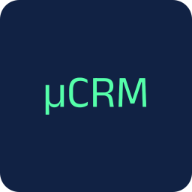
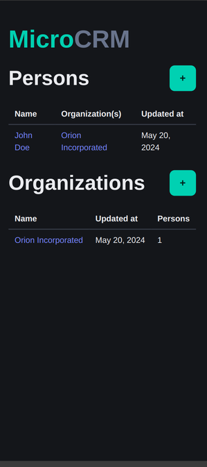
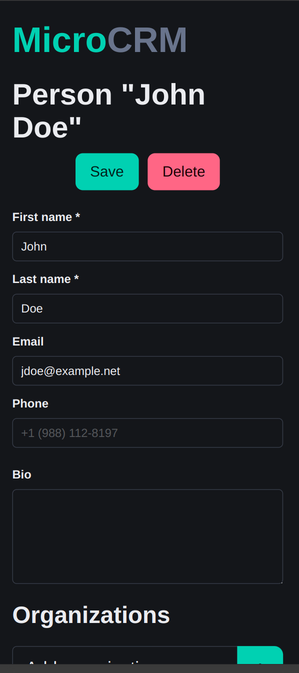

<p align="center">
   
</p>

# MicroCRM (P5 - Expert DevOps - Gérez le cycle de vie de développement logiciel)

MicroCRM est une application de démonstration basique ayant pour être objectif de servir de socle pour le module "P5 - Expert DevOps".

L'application MicroCRM est une implémentation simplifiée d'un ["CRM" (Customer Relationship Management)](https://fr.wikipedia.org/wiki/Gestion_de_la_relation_client). Les fonctionnalités sont limitées à la création, édition et la visualisations des individus liés à des organisations.




## Code source

### Organisation

Ce [monorepo](https://en.wikipedia.org/wiki/Monorepo) contient les 2 composantes du projet "MicroCRM":

- La partie serveur (ou "backend"), en Java SpringBoot 3;
- La partie cliente (ou "frontend"), en Angular 17.

Une intégration basique avec Gitlab CI est définie via le fichier [`.gitlab-ci.yml`](./.gitlab-ci.yml).

### Démarrer avec les sources

#### Serveur

##### Dépendances

- [OpenJDK >= 17](https://openjdk.org/)

##### Procédure

1. Se positionner dans le répertoire `back` avec une invite de commande:

   ```shell
   cd back
   ```

2. Construire le JAR:

   ```shell
   # Sur Linux
   ./gradlew build

   # Sur Windows
   gradlew.bat build
   ```

3. Démarrer le service:

   ```shell
   java -jar build/libs/microcrm-0.0.1-SNAPSHOT.jar
   ```

Puis ouvrir l'URL http://localhost:8080 dans votre navigateur.

#### Client

##### Dépendances

- [NPM >= 10.2.4](https://www.npmjs.com/)

##### Procédure

1. Se positionner dans le répertoire `front` avec une invite de commande:

   ```shell
   cd front
   ```

2. (La première fois seulement) Installer les dépendances NodeJS:

   ```shell
   npm install
   ```

3. Démarrer le service de développement:

   ```shell
   npx @angular/cli serve
   ```

Puis ouvrir l'URL http://localhost:4200 dans votre navigateur.

### Exécution des tests

#### Client

**Dépendances**

- Google Chrome ou Chromium

Dans votre terminal:

```shell
cd front
CHROME_BIN=</path/to/google/chrome> npm test
```

#### Serveur

Dans votre terminal:

```shell
cd back
./gradlew test
```

#### Tests automatisés dans GitLab CI

La pipeline exécute les tests du frontend, du backend et des scripts à chaque
merge request ainsi que sur `dev`, `main`, les tags et les pipelines planifiées.

L’exécution locale nécessite Bash, Python avec les dépendances de test,
ShellCheck et Chrome ou Chromium. Si le navigateur n’est pas détecté,
`CHROME_BIN` doit contenir le chemin de son exécutable.

Depuis la racine du repository, les mêmes tests peuvent être lancés avec :

```shell
bash scripts/ci/test.sh --component frontend
bash scripts/ci/test.sh --component backend
bash scripts/ci/tests/test_scripts.sh
python -m pip install -r scripts/ci/requirements-test.txt
python -m pytest scripts/ci/tests/test_python_scripts.py
shellcheck scripts/ci/*.sh scripts/ci/tests/*.sh
```

| Job GitLab | Vérification | Résultat conservé |
|---|---|---|
| `test:frontend` | Tests Angular, dont les échanges HTTP simulés, et couverture | Rapport de couverture HTML et LCOV |
| `test:backend` | Tests JUnit du contexte, du repository et du CRUD HTTP | Rapport JUnit, rapport HTML et JaCoCo XML |
| `test:scripts:bash` | Commandes Bash, erreurs et dry-run | Log du job |
| `test:scripts:python` | Manifeste et notification | Rapport JUnit pytest |
| `quality:shellcheck` | Analyse statique des scripts Bash | Log du job |
| `quality:sonarqube` | Qualité, sécurité et couverture du code | Dashboard SonarQube et quality gate |
| `quality:trivy:repository` | Vulnérabilités des dépendances et secrets | Rapports Trivy JSON et texte |
| `release:scan:image:frontend` | Vulnérabilités de l’image frontend avant publication | Rapports Trivy JSON et texte |
| `release:scan:image:backend` | Vulnérabilités de l’image backend avant publication | Rapports Trivy JSON et texte |

Avec SonarQube Cloud Free, `quality:sonarqube` s’exécute sur les merge requests
et sur `main`, mais pas sur les push directs vers `dev`.

Les jobs Trivy conservent les vulnérabilités élevées et critiques dans leurs
rapports. Une erreur du scanner, un secret détecté ou une vulnérabilité critique
corrigible fait échouer le job ; les vulnérabilités élevées existantes restent
visibles pour un traitement progressif.

Le détail des scripts se trouve dans [`scripts/ci/README.md`](scripts/ci/README.md)
et la matrice complète dans
[`documentation/ci_cd/05_plan_tests_automatises.md`](documentation/ci_cd/05_plan_tests_automatises.md).

### Images Docker

#### Client

##### Construire l'image

```shell
docker build --target front -t orion-microcrm-front:latest .
```

##### Exécuter l'image

```shell
docker run -it --rm -p 80:80 orion-microcrm-front:latest
```

L'application sera disponible sur http://localhost. En environnement déployé,
HTTPS sera terminé par le point d'entrée du cluster.

#### Serveur

##### Construire l'image

```shell
docker build --target back -t orion-microcrm-back:latest .
```

##### Exécuter l'image

```shell
docker run -it --rm -p 8080:8080 orion-microcrm-back:latest
```

L'API sera disponible sur http://localhost:8080.

#### Tout en un

```shell
docker build --target standalone -t orion-microcrm-standalone:latest .
```

##### Exécuter l'image

```shell
docker run -it --rm -p 8080:8080 -p 80:80 -p 443:443 orion-microcrm-standalone:latest
```

L'application sera disponible sur https://localhost et l'API sur http://localhost:8080.
