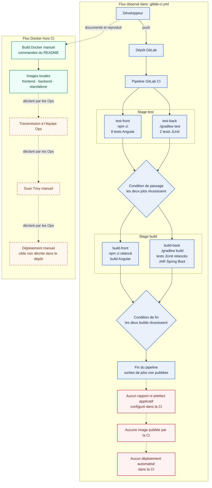

# Workflow CI actuel

**État audité :** branche `dev`, commit `526bd96cddd2903676988b56dfeb2778667aa435`.

**Export :** [SVG](workflow_ci_actuel.svg)

## Lecture du schéma

| Couleur | Nature de l’information |
|---|---|
| Bleu | Configuration observée dans le dépôt et comportement reproduit pendant l’audit |
| Vert | Commandes Docker documentées dans le README et reproduites localement |
| Orange pointillé | Pratique déclarée dans le sondage Ops, non observable dans la CI actuelle |
| Rouge | Fonction absente de la configuration GitLab CI actuelle |

Les deux jobs d’un même stage peuvent s’exécuter en parallèle. Le stage suivant ne commence que si les deux jobs précédents réussissent.

## Sources

- `.gitlab-ci.yml` au commit audité ;
- `README.md` pour les commandes Docker ;
- mesures locales de l’audit pour les tests, builds et images ;
- sondage Ops pour la transmission, le scan Trivy et le déploiement manuels.
