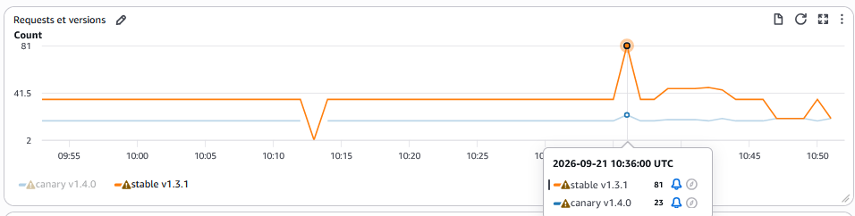
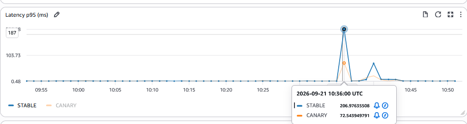
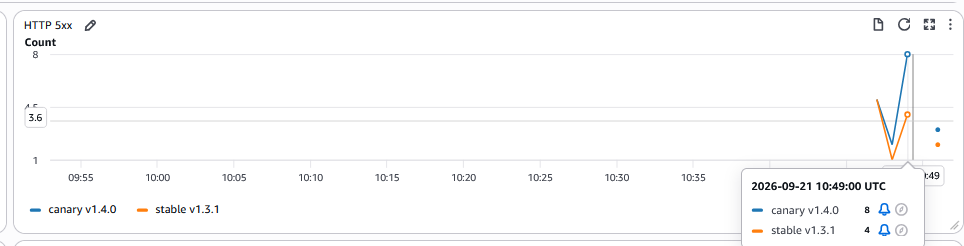
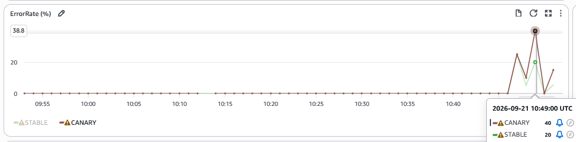
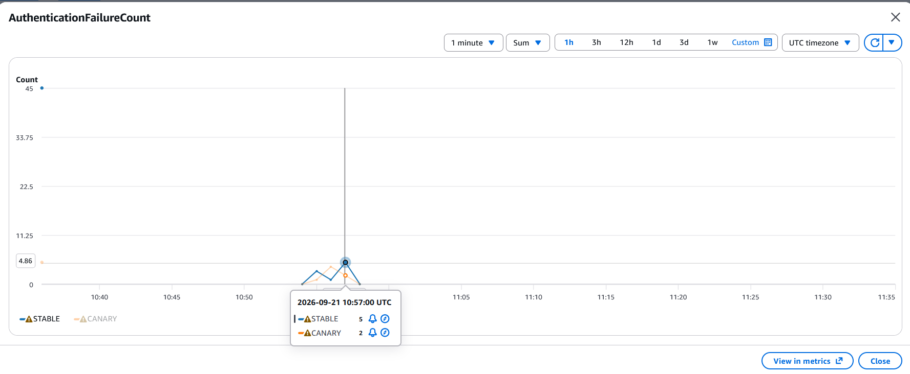
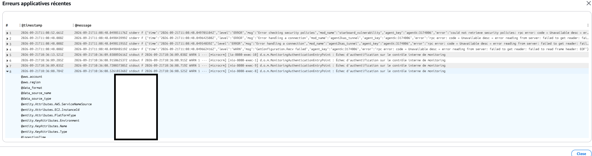

# Supervision

CloudWatch suit l'état des deux EC2 et de l'application pendant les
déploiements. Les dashboards aident à distinguer un problème de nœud d'une
dégradation propre à la version Canary ; les alarmes avertissent l'opérateur
mais ne décident pas à sa place de promouvoir ou d'abandonner une version.

## Dashboard CloudWatch

Lorsque CloudWatch est activé, Terraform crée :

- `microcrm-poc-infrastructure`, qui sépare l'EC2 staging et l'EC2 production ;
- `microcrm-application-production`, qui compare stable et Canary.

## Métriques

### Métriques EC2

Chaque EC2 dispose de CPU, RAM, disque, réseau et `StatusCheckFailed`. Les
InstanceId viennent directement des outputs du module Terraform ; aucun
identifiant n'est codé en dur.

### Métriques applicatives

Le backend publie en StatsD vers le CloudWatch Agent du nœud :

- `RequestCount` ;
- `ServerErrorCount` pour les réponses 5xx ;
- `Latency` avec une valeur par requête, permettant réellement `p95` ;
- `AuthenticationFailureCount` depuis le handler Spring Security réellement
  utilisé.

`AuthenticationFailureCount` ne représente pas une authentification métier
historique : MicroCRM n'en possédait pas. La métrique repose exclusivement sur
le mécanisme `/internal/auth-check` ajouté pour le contrôle du monitoring. Cet
endpoint est protégé par HTTP Basic ; les routes applicatives existantes,
notamment le CRUD `/persons`, restent publiques et sont couvertes par les tests
d'intégration.

Les dimensions applicatives sont bornées à `Environment`, `Track` et `Version`.
Une seconde série sans `Version` alimente les alarmes sur le Canary courant.
L'agent ajoute aussi l'`InstanceId` de l'EC2 production ; Terraform le référence
depuis l'output compute, jamais en dur. Aucun userId, requestId, token, en-tête
Authorization, IP ou URL complète n'est publié.

Le dashboard calcule `ErrorRate = ServerErrorCount / RequestCount * 100` avec
`IF` et `FILL` pour retourner zéro lorsque le nombre de requêtes est nul ou
qu'aucun 5xx n'existe.

#### Validation du dashboard applicatif

Les captures suivantes, réalisées le 21 septembre 2026 sur le dashboard
`microcrm-application-production`, confirment la séparation des séries stable et
Canary. Les requêtes et leurs versions restent identifiables pour chaque track.



La latence p95 permet de comparer les deux versions sur une même période et de
repérer les variations ponctuelles.



Les valeurs 5xx et `ErrorRate` ci-dessous proviennent d'un test synthétique
contrôlé avec `aws cloudwatch put-metric-data`. Elles valident la restitution du
dashboard et son calcul, mais ne constituent pas un incident applicatif réel ni
une preuve de génération end-to-end d'une réponse HTTP 500 par le backend.





Le contrôle de sécurité `/internal/auth-check` appelé avec des identifiants
volontairement invalides produit un HTTP 401 et incrémente la métrique dédiée.
La répartition observée, 45 échecs sur stable et 5 sur Canary, correspond au
routage 90/10 utilisé pendant le test.



## Logs applicatifs

Les groupes `/microcrm/poc/{system,kubernetes,traefik}` collectent les journaux
des deux nœuds avec une rétention de trois jours. Traefik écrit ses accès en
JSON sans conserver les en-têtes ni les paramètres de requête.

La recherche des événements récents permet notamment de retrouver les refus
d'authentification générés pendant le contrôle du monitoring.



## CloudWatch Logs Insights

Logs Insights permet de rapprocher un incident de ses journaux. Sélectionner
`/microcrm/poc/kubernetes`, limiter la période au déploiement et rechercher
`ERROR`, `Liquibase` ou `AuthenticationFailure`. Dans
`/microcrm/poc/traefik`, examiner les réponses 5xx et les chemins HTTP ; un
statut isolé doit être replacé dans le parcours testé avant diagnostic.

## Alarmes

Les deux EC2 disposent d'alarmes de disponibilité et de CPU. Pendant un
Canary, quatre alarmes suivent la nouvelle version pour repérer rapidement
une dégradation :

| Indicateur Canary | Rôle | Seuil |
|---|---|---|
| Réponses 5xx | Repérer les erreurs serveur | Au moins 1 en 5 min |
| Taux de 5xx | Rapporter les erreurs au trafic | Au moins 5 % sur deux périodes de 5 min |
| Échecs d'authentification | Repérer les refus sur l'endpoint protégé | Au moins 1 en 5 min |
| Latence p95 | Suivre les requêtes les plus lentes | Au moins 1 000 ms sur deux périodes de 5 min |

Une latence p95 de 1 000 ms signifie que 95 % des requêtes répondent en une
seconde ou moins. Pour le taux de 5xx, l'alarme utilise la série du Canary
courant sans dimension `Version` et retourne zéro si `RequestCount` vaut zéro.
Les alarmes peuvent notifier SNS ; l'opérateur examine les métriques avant de
lancer une décision Canary ou un rollback. Le déroulement des décisions est
décrit dans la [stratégie de déploiement](../ci-cd/deployment-strategy.md).

Pour observer un Canary, ouvrir `microcrm-application-production` dans
CloudWatch et comparer les séries stable/Canary. Cette consultation est
manuelle : il n'existe pas de job `observation:cloudwatch` ni de période
d'observation automatisée par la pipeline.

## Notifications Slack

Le canal opérationnel prévu est `#microcrm-devops`. Les jobs Helm notifient les
déploiements et les rollbacks, réussis ou échoués. Les jobs Trivy notifient un
échec de contrôle de sécurité ; le rapport du job précise ensuite s'il s'agit
d'une vulnérabilité, d'un secret détecté ou d'une erreur du scanner.

L'envoi utilise `scripts/ci/notify.py` et un **Incoming Webhook** Slack conservé
dans la variable GitLab `SLACK_WEBHOOK_URL`. Sa protection est décrite dans la
[documentation de sécurité](../quality/security.md).

Créer l'Incoming Webhook dans Slack, récupérer son URL puis l'ajouter dans
**Settings > CI/CD > Variables** sous le nom `SLACK_WEBHOOK_URL`. Le message
contient uniquement le type d'événement, le statut, le job lorsqu'il est fourni,
le lien et l'identifiant du pipeline, la branche ou le tag et les huit premiers
caractères du commit.

Les appels actuels proviennent des jobs Helm
`deploy:helm:staging:release-or-rollback`, les jobs Canary et le rollback de
production, ainsi que des contrôles Trivy
`quality:trivy:repository`, `quality:trivy:kubernetes`,
`release:trivy:image:frontend` et `release:trivy:image:backend` en cas d'échec.

L'envoi dépend de la configuration effective de `SLACK_WEBHOOK_URL` dans
GitLab ; sans cette variable, les jobs passent la notification.

La [capture des notifications Slack](../quality/evidence/slack_notifications_deploiement_rollback_15_16_09_26.png)
montre des événements réels de déploiement, de Canary et de rollback, dont un
succès de `rollback:helm:production:release` sur la pipeline `#2848029220`.

## Diagnostic rapide

Depuis une session autorisée, contrôler d'abord les EC2 et les nœuds K3s :

```bash
aws ec2 describe-instance-status
kubectl get nodes -o wide
```

Le résultat attendu est un état sain pour les deux EC2 et deux nœuds K3s
`Ready`. Après contrôle du contexte GitLab Agent, examiner les composants de
chaque environnement :

```bash
kubectl -n microcrm-prod get pods,svc,events
kubectl -n microcrm-staging get pods,svc,events
```

Les Pods Traefik se trouvent dans `kube-system`. Les jobs `verify` complètent
ce diagnostic par des vérifications HTTP de l'application.

## Exploitation des données

Les observations issues du monitoring sont synthétisées et analysées dans [`../quality/performance.md`](../quality/performance.md).
