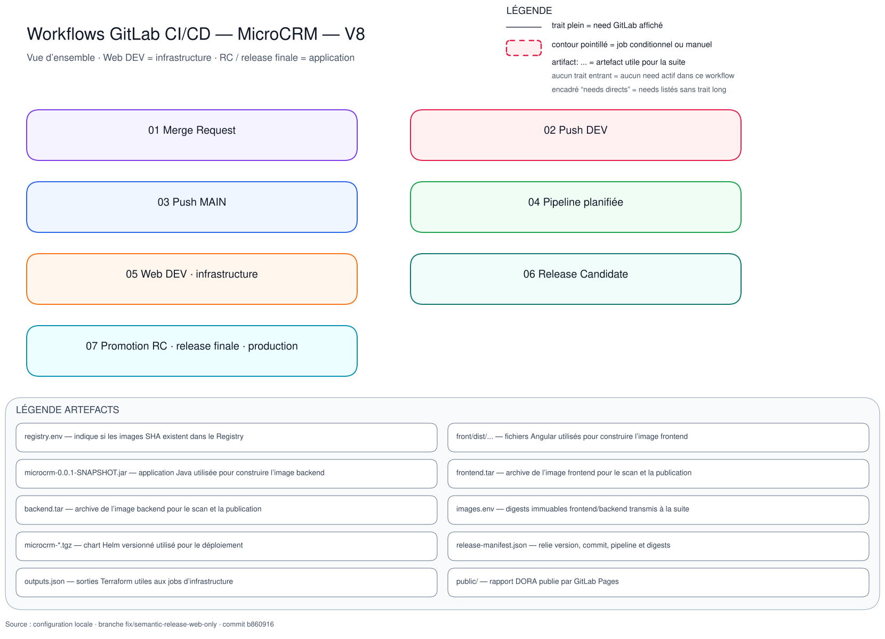

# Pipeline CI/CD

## Fonctionnement de la pipeline

La pipeline sépare les contrôles du code, la préparation de l'infrastructure
et le déploiement des releases. Les règles globales `workflow:rules`
autorisent les merge requests, les planifications, les pipelines Web, les
tags et les pushes sur `dev` ou sur la branche principale. Le fichier
`common.yml` exclut les jobs applicatifs des parcours Web et planifiés.

Les onze stages suivent l'ordre ci-dessous :

| Parcours | Stages | Rôle |
|---|---|---|
| Contrôles et images | `test`, `quality`, `build`, `release` | Tester, scanner, publier les images et préparer les bundles |
| Infrastructure | `terraform-network`, `terraform-plan`, `terraform-apply`, `ansible` | Provisionner AWS puis configurer K3s |
| Application | `helm`, `verify`, `canary-decision` | Déployer, vérifier, puis proposer une décision Canary |

Une dépendance `needs` permet à un job de démarrer dès que les jobs dont il
dépend sont terminés, sans attendre tout le stage précédent.

La chaîne applique **Build Once, Promote Many** aux images : elles sont
publiées sous le tag du commit (`CI_COMMIT_SHA`), puis réutilisées par les
pipelines de release et les environnements sans reconstruction lors de la
promotion finale. Certains tests et contrôles statiques sont toutefois
rejoués pour un SHA inchangé ; réutiliser les validations déjà réussies et ne
relancer que les contrôles dépendants de l'environnement ou de données
externes évolutives serait pertinent, mais reste hors du périmètre actuel par
manque de temps.

### Workflows CI/CD

Les schémas SVG sont consultables dans VS Code et GitLab ; ils sont regroupés
dans le [dossier `workflows`](../LIVRABLES/assets/diagrammes/workflows/).

| Déclencheur | Schéma | Parcours distinctif |
|---|---|---|
| Merge request | [01 — voir le schéma](../LIVRABLES/assets/diagrammes/workflows/01_MERGE_REQUEST.svg) | Tests, qualité et plan réseau, sans apply |
| Push `dev` | [02 — voir le schéma](../LIVRABLES/assets/diagrammes/workflows/02_PUSH_DEV.svg) | Images SHA ; suggestion RC manuelle, sans Helm |
| Push `main` | [03 — voir le schéma](../LIVRABLES/assets/diagrammes/workflows/03_PUSH_MAIN.svg) | Contrôles et images, sans Helm production |
| Schedule `dev` | [04 — voir le schéma](../LIVRABLES/assets/diagrammes/workflows/04_PIPELINE_PLANIFIEE.svg) | `pages:dora` uniquement |
| Web `dev` | [05 — voir le schéma](../LIVRABLES/assets/diagrammes/workflows/05_WEB_DEV_INFRASTRUCTURE.svg) | Réseau, compute, Ansible ; destroy manuel distinct |
| Tag RC | [06 — voir le schéma](../LIVRABLES/assets/diagrammes/workflows/06_RELEASE_RC.svg) | Réutilisation SHA, bundle, staging manuel |
| Tag final | [07 — voir le schéma](../LIVRABLES/assets/diagrammes/workflows/07_PROMOTION_RC_RELEASE_PRODUCTION.svg) | `Promote-From`, digests RC, canary manuel |

Les jobs build d'une RC restent présents même si `check:registry:images`
constate les deux images : leurs scripts sautent alors compilation et build
Docker. Une finale n'inclut pas ces jobs. Le déploiement canary est manuel ;
`verify:production:canary` suit automatiquement son succès. Les jobs
`promote:helm:production:canary` et `abort:helm:production:canary` sont des
décisions manuelles optionnelles non bloquantes.

## Pipelines de release

Les étapes ci-dessous relient le commit testé sur `dev` à une release
déployable, sans reconstruire les images lors de la promotion finale.

### Étapes de livraison

1. valider le code puis construire, tester, scanner et publier les images SHA
   dans la pipeline de push sur `dev` ;
2. dans cette même pipeline, lancer manuellement `release:suggest:version`
   pour obtenir le prochain numéro RC calculé depuis les Conventional Commits ;
   le job est un dry-run et ne crée aucun tag ;
3. créer manuellement la RC proposée `vX.Y.Z-rc.N` et la valider en staging ;
4. après merge vers `main`, créer manuellement le tag final proposé, annoté avec
   `Promote-From: vX.Y.Z-rc.N` ;
5. vérifier que les sources influençant les images sont inchangées, puis
   reprendre les digests de la RC sans rebuild ;
6. produire avec `release:manifest` le lien entre tag, commit, pipeline et
   images `repository@sha256`, conserver le manifeste, `images.env` et le
   chart avec `release:bundle` dans le Generic Package Registry, puis créer
   la release GitLab avec `release:create` ;
7. lancer manuellement `deploy:helm:production:canary` ; ce job est bloquant
   afin que `verify:production:canary` parte automatiquement après son succès ;
8. après le verify, la pipeline est `SUCCESS` et les jobs manuels optionnels
   `promote:helm:production:canary` et `abort:helm:production:canary` restent
   disponibles dans cette même pipeline.

Les deux décisions finales utilisent `when: manual` avec
`rules:allow_failure: true`. Ne pas les lancer ne bloque donc pas la pipeline.
Si une décision est lancée et échoue, son job devient rouge avec son diagnostic,
mais le succès déjà obtenu par la pipeline reste inchangé. Chaque script
termine néanmoins avec un code non nul sur digest, rollout ou smoke test
incorrect.

Les jobs de déploiement téléchargent le bundle du tag et utilisent les images
`repository@sha256` ; ils ne compilent, ne construisent, ne poussent et ne
retaggent aucune image.

Voir aussi [`deployment-strategy.md`](./deployment-strategy.md).

Le rollback utilise la pipeline d'une ancienne release ; sa procédure est
décrite dans le [rollback applicatif](../Maintenance/rollback.md).

### Versioning

Les RC utilisent `vMAJOR.MINOR.PATCH-rc.N` et les finales
`vMAJOR.MINOR.PATCH`. Le manifeste final relie aussi la RC promue et son commit
source aux digests frontend/backend conservés.

Semantic Release ne publie rien dans ce workflow. Son plugin
`@semantic-release/commit-analyzer` calcule uniquement le prochain numéro à
partir des Conventional Commits :

- `fix(scope): ...` produit une version corrective (`PATCH`) ;
- `feat(scope): ...` produit une version mineure (`MINOR`) ;
- `type(scope)!: ...` ou `BREAKING CHANGE: ...` produit une version majeure
  (`MAJOR`) ;
- `docs`, `chore`, `ci`, `test`, `style` et `refactor` ne changent pas le numéro
  par défaut.

Une nouvelle RC nécessite un commit produisant une release depuis la dernière
version calculée. Pour rejouer exactement la même RC, relancer sa pipeline
existante plutôt que créer un nouveau tag. La création des tags RC/final, la
mention `Promote-From`, les déploiements et les rollbacks restent manuels.

## Traçabilité des versions et déploiements

Depuis la release GitLab et son manifeste, on retrouve :

* le commit SHA associé à une version ;
* le tag / numéro de release ;
* l'image Docker publiée et son digest ;
* l'environnement sur lequel la version a été déployée ;
* le déploiement GitLab correspondant.

Les scripts sont décrits dans [`scripts/ci/scripts.md`](../../scripts/ci/scripts.md) ;
la stratégie fonctionnelle est décrite dans
[Stratégie de release et de promotion](deployment-strategy.md).
