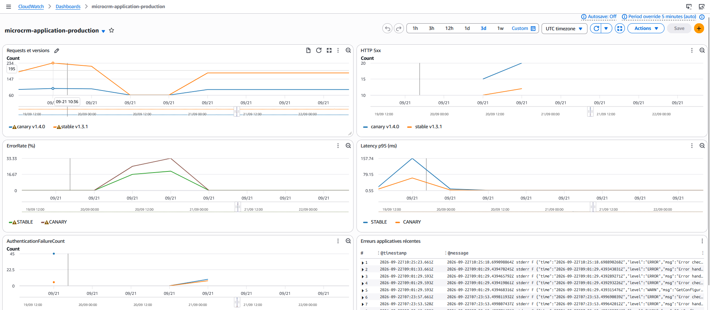
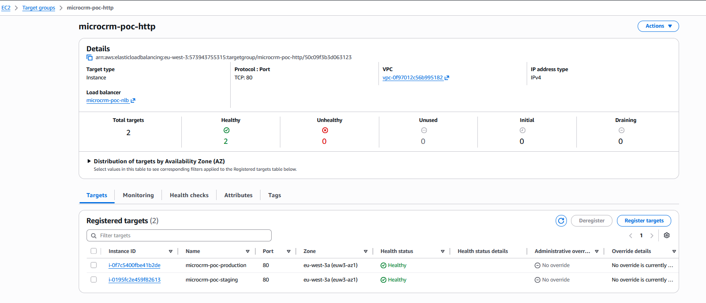

# Rapport de performance du POC

## 1. Objectif et périmètre

Ce rapport mesure les effets observables de la modernisation CI/CD de MicroCRM.
Il couvre la qualité du pipeline, la sécurité, CloudWatch, le NLB, les réplicas,
PostgreSQL, le Canary et les indicateurs DORA. CloudWatch répond ici au besoin
fonctionnel attribué à ELK : afficher des métriques, journaux et alertes.

## 2. Méthode et limites de la baseline

La baseline du commit `526bd96cddd2903676988b56dfeb2778667aa435`
contient des tests, de la couverture, quatre jobs et les alertes npm, mais aucune
durée de pipeline ni mesure AWS historique. Ces valeurs ne sont donc pas
inventées. Les mesures du 16 au 22 septembre 2026 constituent la référence
reproductible actuelle du POC.

| Indicateur comparable | Avant | Après | Gain ou conclusion |
|---|---:|---:|---|
| Tests frontend réussis | 8 | 14 | +6 tests |
| Tests backend réussis | 2 | 8 | +6 tests |
| Couverture frontend — lignes | 30,76 % | 40,65 % | +9,89 points |
| Couverture frontend — branches | 9,52 % | 9,52 % | stable |
| Définitions de jobs CI | 4 | 42 | périmètre automatisé élargi ; tous ne s'exécutent pas sur chaque trigger |
| Contrôles sécurité automatisés | aucun | Gitleaks, Trivy et SonarQube | détection avant livraison |
| Durée des pipelines push `dev` | non mesurée | moyenne 10 min 57 s ; médiane 10 min 37 s sur 7 pipelines | référence actuelle, aucun gain historique calculable |

La [capture des pipelines push `dev`](evidence/performance/pipeline_push_dev_durations_22_09_26.png)
montre les durées `10:30`, `10:36`, `10:37`, `11:12`, `11:00`, `12:19` et
`10:22`. La moyenne vaut `(630 + 636 + 637 + 672 + 660 + 739 + 622) / 7`, soit
`656,57 s` ou `10 min 56,57 s`, arrondie à `10 min 57 s`. La médiane est
`10 min 37 s`. La capture est une liste de pipelines **push**, malgré son nom
initial qui mentionnait Web.

## 3. Sécurité : résultats et corrections

Les artefacts du commit `71f7d64`, générés par la pipeline réussie
`#2870894000`, constituent l'état CI après correction. La
[synthèse sécurité](evidence/security/SECURITY_EVIDENCE_2026-09-22.md) et la
[décision CVE-2026-56854](evidence/security/CVE-2026-56854-decision.md)
conservent le détail et les limites.

Corrections vérifiées localement le 22 septembre 2026 :

- PostgreSQL JDBC `42.7.11` vers `42.7.12` : 8 tests backend, `bootJar` et
  résolution de dépendance réussis ;
- Angular `17.3.8` vers `20.3.31` : 14 tests et build de production réussis ;
- dépôt et image backend : Trivy retourne 0 HIGH et 0 CRITICAL ;
- image frontend : 16 occurrences HIGH, 15 identifiants distincts et
  0 CRITICAL dans Caddy après application de l'ignore nominatif ;
- Gitleaks et les scans de secrets des images : 0 secret ;
- IaC : 3 constats HIGH correspondant aux décisions d'architecture du POC.

Les trois rapports de vulnérabilités passent de 65 à 16 occurrences HIGH, soit
une baisse de 49 occurrences ou 75,4 %. Un scan local sans l'ignorefile retourne
17 HIGH : les 16 du rapport CI et `CVE-2026-56854`. La correction reste donc
**partielle** tant que les HIGH du binaire Caddy ne sont pas corrigés par une
image amont ou couverts par des décisions de risque explicites.

Ces artefacts n'ont pas besoin d'être remplacés à chaque pipeline documentaire.
Un nouvel export est utile si les dépendances, les Dockerfiles ou les règles de
scan changent, ou une dernière fois pour archiver la pipeline finale de la MR.

## 4. CloudWatch : métriques, journaux et alertes

Le dashboard applicatif sépare stable et Canary pour les requêtes, versions,
latence p95, 5xx, taux d'erreur et échecs d'authentification. Les captures et
leur interprétation sont regroupées dans la
[documentation de supervision](../Maintenance/supervision.md#validation-du-dashboard-applicatif).
Les 5xx et le taux d'erreur visibles proviennent d'un test synthétique ; ils ne
doivent pas être présentés comme un incident réel.

Cette vue unique montre les séries stable et Canary, les erreurs 5xx, le taux
d'erreur, la latence p95, les échecs d'authentification et les erreurs
applicatives récentes. Les erreurs ont été provoquées manuellement pour valider
le fonctionnement des widgets et des journaux ; elles ne correspondent pas à
une dégradation spontanée du service.

## 5. NLB, réplicas, PostgreSQL et Canary

Le test NLB du 16 septembre 2026 a exécuté 50 requêtes séquentielles :

| Requêtes | HTTP 200 | Minimum | Moyenne | P95 | Maximum |
|---:|---:|---:|---:|---:|---:|
| 50 | 50 | 46,64 ms | 60,98 ms | 111,27 ms | 120,28 ms |

Preuves : [protocole et sortie](evidence/performance/PREUVE_PERFORMANCE_NLB_2026-09-16.md)
et [capture](evidence/performance/performance_nlb_50_requetes_http_200.png).
Ce test démontre la disponibilité de la route pendant environ quatre secondes ;
il ne démontre ni une capacité maximale, ni un failover, ni la distribution
entre les deux EC2.

| Mécanisme | Après observé | Impact démontré | Limite |
|---|---|---|---|
| NLB | deux cibles TCP saines ; 50/50 réponses HTTP 200 | point d'entrée unique disponible pendant le test | aucune panne de cible provoquée |
| Réplicas | deux réplicas frontend/backend configurés | rollouts et nombre de Pods contrôlés | gain de débit et tolérance à la panne non mesurés |
| PostgreSQL | StatefulSet persistant à un replica | persistance au redémarrage du Pod | pas de haute disponibilité ni de restauration automatisée |
| Canary | stable/Canary séparés, routage 90/10 observé | exposition initiale limitée à 10 % | ne prouve pas un gain de vitesse |

Preuves complémentaires : [tests du POC](evidence/performance/TESTS_MICROCRM_2026-09-16.md),
[Canary réussi](evidence/performance/canary_succeed_1.4.0.png),
[comptage 90/10](evidence/performance/résultat_comptage_canary_90_10.png) et
[cibles NLB saines](evidence/performance/nlb_target_group_healthy_22_09_26.png).

La capture montre deux cibles enregistrées, deux `Healthy` et zéro `Unhealthy`.
Elle prouve leur état au moment de la consultation, pas le comportement lors de
la perte volontaire d'une cible.

## 6. Indicateurs DORA

Le job non bloquant `pages:dora` interroge l'API GitLab avec
`DORA_GITLAB_TOKEN` et publie `index.html`, `dora-metrics.json` et
`dora-metrics.csv` dans `public/`, sur une fenêtre de 90 jours.

| Indicateur | Calcul dans MicroCRM |
|---|---|
| Fréquence de déploiement | déploiements GitLab réussis, ramenés à une semaine |
| Délai des changements | médiane entre fusion d'une MR et premier déploiement réussi |
| Taux d'échec des changements | part des déploiements reliés à un incident GitLab `dora` |
| Temps de restauration | médiane entre création et clôture des incidents reliés |

Sans échantillon, la valeur correcte est `N/A`, jamais zéro.

La merge request de `chore/modifications` vers `dev` est en cours. Après sa
pipeline finale, télécharger l'artifact de `pages:dora`, archiver les fichiers
de `public/` dans `docs/quality/evidence/performance/dora/`, puis reporter ici
les quatre valeurs et leurs échantillons.

## 7. Gains et recommandations d'amélioration continue

### Gains obtenus

Les indicateurs absents de l'audit initial sont indiqués comme non mesurés ; ils
ne sont pas reconstruits a posteriori.

| Indicateur | Avant — audit initial | Après — état actuel |
|---|---|---|
| Contrôles automatisés avant livraison | Tests et builds uniquement ; scan d'images manuel déclaré par les Ops | Tests, SonarQube, Gitleaks et scans Trivy automatisés |
| Déploiement | Manuel via Docker selon le sondage Ops ; absent de la CI | Terraform, Ansible et Helm dans la CI ; Canary et promotion contrôlés manuellement |
| Délai des changements | Non mesuré | 1,75 jour en production ; 2,82 jours en staging |
| Fréquence de déploiement | Non mesurée | 1,24 par semaine en production ; 2,72 en staging |
| Taux d'échec des déploiements | Non mesuré | 0 % en production ; 4 % en staging |
| Temps de restauration | Non mesuré | `N/A` en production ; 0,61 minute en staging |
| Traçabilité des déploiements | Aucun déploiement dans la CI auditée | Environnements GitLab et manifeste reliant version, commit, pipeline et digests |
| Reconstruction de l'environnement | Non documentée dans le dépôt audité | Infrastructure et configuration via Terraform/Ansible ; bootstrap externe incomplet |
| Versionnage des images | Images locales sans digest immuable | Version sémantique, SHA et digests immuables |
| Santé des services | Aucun healthcheck dans l'état audité | Probes startup, readiness et liveness définies dans Helm |
| Validation après déploiement | Non documentée dans la CI auditée | Contrôle des rollouts et smoke tests Kubernetes/HTTP |
| Visibilité sur l'exécution | Aucun rapport ni artifact conservé par la CI | Artifacts GitLab, métriques, logs et alarmes CloudWatch |

### Recommandations d'amélioration continue

1. **Traiter les HIGH Caddy restants.** Mettre à jour l'image officielle dès
   qu'elle embarque les versions Go corrigées ; documenter les risques acceptés
   entre-temps.
2. **Finaliser la mesure DORA.** Archiver l'export de la pipeline finale et
   conserver `N/A` lorsqu'aucun incident ou déploiement ne permet le calcul.
3. **Étendre les tests applicatifs.** Ajouter un parcours E2E CRUD et un scan
   DAST passif sur staging avant d'envisager un contrôle bloquant.
4. **Mesurer la résilience.** Compléter le test séquentiel par un test concurrent
   léger et, hors POC, par un exercice de perte de cible NLB.
5. **Durcir les données.** Tester sauvegarde/restauration et prévoir une cible
   PostgreSQL haute disponibilité avant une vraie production.
6. **Réduire les opérations manuelles.** Terminer ultérieurement le bootstrap
   GitLab/AWS et automatiser une fenêtre d'observation CloudWatch du Canary.

## 8. Conclusion

Le POC démontre une chaîne CI/CD couvrant l'intégration, la sécurité, la
construction, la release et le déploiement. Les tests et la couverture ont
progressé, les occurrences HIGH des trois rapports Trivy ont diminué de 75,4 %,
et les images sont promues par digest sans reconstruction. CloudWatch rend
visibles les requêtes, les erreurs, la latence, l'authentification et les logs ;
le NLB a répondu 50 fois sur 50 avec un p95 de 111,27 ms et ses deux cibles sont
saines sur la capture.

Les limites restent explicites : le test HTTP est séquentiel, aucun failover
n'a été provoqué, PostgreSQL n'est pas hautement disponible et les HIGH Caddy
restants doivent encore être traités ou acceptés. Les valeurs DORA seront
intégrées à partir de la pipeline finale de la merge request en cours.
