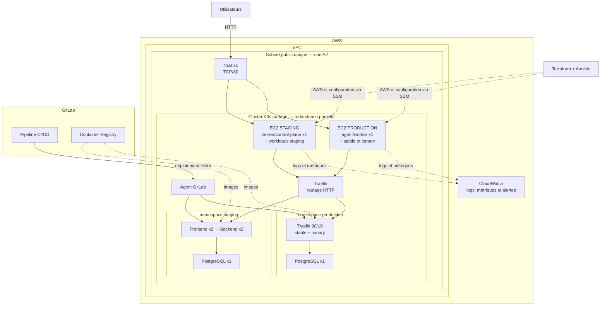

# Architecture globale du POC MicroCRM

Vue d’ensemble de l’infrastructure AWS, du cluster K3s, des déploiements
GitLab CI/CD et de la supervision du POC MicroCRM.

## Schéma

Le trafic utilisateur entre par le NLB, puis Traefik le dirige vers le
frontend de l'environnement demandé. En production, son routage pondéré natif
sépare stable et Canary sur l'EC2 production. GitLab déploie les releases Helm par son
agent, tandis que les Pods récupèrent leurs images dans le Container Registry.
Terraform provisionne AWS, Ansible configure les deux nœuds par SSM et
CloudWatch centralise leur supervision.

## Limites du POC

Le POC dispose de deux EC2, mais d’un seul control-plane K3s.

- **Si l'EC2 staging tombe :** les Pods présents sur l'EC2 production peuvent continuer à
  fonctionner, mais le cluster ne peut plus les déployer ou les remplacer.
- **Si l'EC2 production tombe :** le control-plane reste disponible, mais les
  `nodeSelector` empêchent de déplacer implicitement la production en staging.
- **PostgreSQL reste non redondé** et son stockage local demeure un point
  unique de défaillance.

Le NLB distribue le trafic TCP vers les deux EC2, tandis que Traefik gère le
routage HTTP dans K3s. Ce découpage est cohérent et simple pour le POC. Un ALB
ajouterait une seconde couche de routage HTTP, partiellement redondante avec
Traefik.

En production, il faudrait plusieurs nœuds `server` K3s répartis sur plusieurs
zones, des workers redondés et une base de données hautement disponible.
