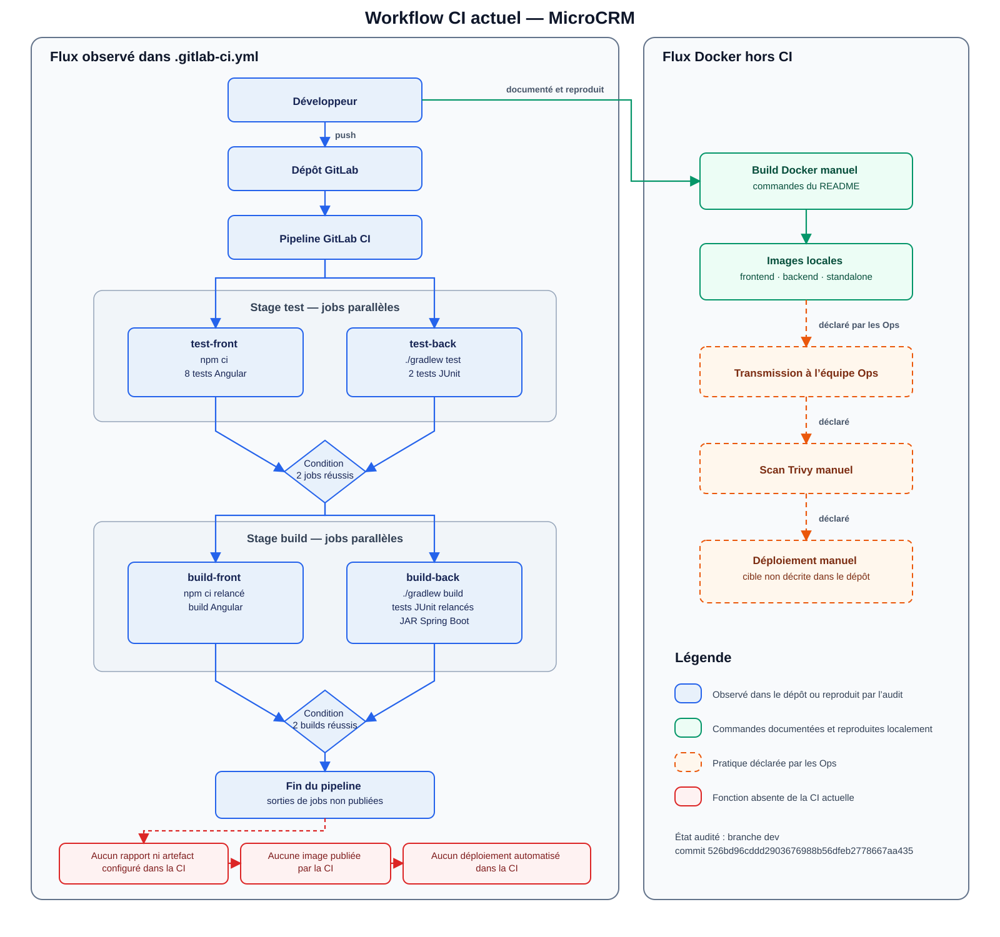

# Veille technologique, audit et recommandations

**Projet :** MicroCRM

**Périmètre actuel :** audit et veille technologique de la chaîne CI/CD

**Baseline de l’audit :** 26 juillet 2026

## Sommaire

1. [Introduction](#1-introduction)
2. [Rapport de veille technologique](#2-rapport-de-veille-technologique)
3. [Audit des processus de développement](#3-audit-des-processus-de-développement)
4. [Recommandations](#4-recommandations)
5. [Conclusion](#5-conclusion)

## 1. Introduction

### 1.1 Objectif

Établir l’état de la chaîne CI/CD de MicroCRM, rapprocher les besoins des équipes Dev et Ops, puis identifier les améliorations à comparer pendant la veille technologique.

### 1.2 Contexte

MicroCRM est un monorepo GitLab composé d’un frontend Angular et d’un backend Spring Boot. La CI actuelle teste et construit les deux composants. Les images Docker sont ensuite construites, contrôlées et transmises manuellement selon les équipes.

| Indicateur initial | Résultat |
|---|---:|
| Jobs GitLab CI | 4 |
| Tests frontend réussis | 8 |
| Tests backend réussis | 2 |
| Couverture frontend — lignes | 30,76 % |
| Couverture frontend — branches | 9,52 % |
| Alertes de vulnérabilité npm | 64 |

## 2. Rapport de veille technologique

> Cette section sera complétée après l’audit. Une technologie ne sera retenue que si elle répond à un besoin vérifié de MicroCRM.

### 2.1 Méthodologie

La veille technologique s’appuie sur les résultats de l’audit du repository MicroCRM et sur les besoins exprimés dans les sondages Dev et Ops.

Les recherches sont limitées aux solutions répondant aux difficultés constatées : automatisation, qualité du code, sécurité, gestion des images, portabilité, persistance des données et traçabilité des releases.

Pour chaque sujet, deux ou trois solutions sont étudiées à partir de documentations officielles et récentes. Elles sont ensuite comparées selon leur compatibilité avec GitLab et AWS, leur complexité, leur coût et leur valeur pour MicroCRM.

Les technologies sans besoin identifié sont écartées afin de conserver une solution simple et adaptée au projet.

Les références utilisées sont indiquées dans chaque fiche technologique avec le nom de l’organisme, l’URL et la date de consultation. Aucune source physique n’a été nécessaire.

### 2.2 Technologies évaluées

#### 2.2.1 GitLab CI/CD

- **Description :** plateforme CI/CD déjà utilisée par MicroCRM et imposée pour le projet.
- **Catégorisation :** automatisation CI/CD et gestion des résultats.
- **Fonctionnalités clés :** pipelines, jobs, templates YAML, cache, artifacts, rapports et variables CI/CD.
- **Cas d’usage MicroCRM :** mutualiser la configuration, conserver les builds et rapports, puis transmettre les mêmes artifacts entre les stages.
- **Contraintes et coût :** les fonctionnalités de base existent dans le tier Free ; les minutes de runner, le stockage et certaines fonctions avancées doivent être vérifiés selon le compte GitLab.
- **Références :** GitLab, [Job artifacts](https://docs.gitlab.com/ci/jobs/job_artifacts/), [Caching in GitLab CI/CD](https://docs.gitlab.com/ci/caching/) et [Use CI/CD configuration from other files](https://docs.gitlab.com/ci/yaml/includes/), consultés le 29 juillet 2026.

#### 2.2.2 SonarQube Cloud

- **Description :** service SaaS d’analyse statique du code administré par Sonar.
- **Catégorisation :** qualité du code et sécurité applicative.
- **Fonctionnalités clés :** analyse des bugs, vulnérabilités, code smells, duplications et couverture, avec quality profiles et quality gates.
- **Cas d’usage MicroCRM :** analyser le frontend Angular et le backend Spring depuis GitLab CI, puis contrôler la qualité du nouveau code.
- **Contraintes et coût :** aucun serveur à maintenir, mais le code et les résultats sont traités par un service externe ; les limites du plan dépendent notamment du volume de code privé.
- **Références :** Sonar, [Getting started with GitLab](https://docs.sonarsource.com/sonarqube-cloud/getting-started/gitlab) et [Quality gates](https://docs.sonarsource.com/sonarqube-cloud/standards/quality-gates), consultés le 29 juillet 2026.

#### 2.2.3 SonarQube Server Community Build

- **Description :** version gratuite et self-hosted de la solution SonarQube.
- **Catégorisation :** qualité du code et sécurité applicative.
- **Fonctionnalités clés :** analyse Java, JavaScript et TypeScript, suivi de la dette technique, quality gates et intégration CI/CD.
- **Cas d’usage MicroCRM :** conserver l’analyse dans une infrastructure maîtrisée et transmettre les résultats depuis GitLab CI.
- **Contraintes et coût :** pas de licence pour Community Build, mais une instance, une base de données, les mises à jour et la supervision restent à maintenir ; Sonar recommande au minimum 4 Go de RAM, 2 CPU et 30 Go de disque pour une petite installation.
- **Références :** Sonar, [Community Build](https://www.sonarsource.com/products/sonarqube/downloads/), version courante `26.7`, et [Server host requirements](https://docs.sonarsource.com/sonarqube-server/server-installation/server-host-requirements), consultés le 29 juillet 2026.

#### 2.2.4 Trivy

- **Description :** scanner de sécurité open source développé par Aqua Security.
- **Catégorisation :** sécurité des dépendances, images, configurations et secrets.
- **Fonctionnalités clés :** scan des images, filesystems et repositories, détection de vulnérabilités, misconfigurations et secrets, génération de rapports et de SBOM.
- **Cas d’usage MicroCRM :** scanner les images frontend et backend après leur build et avant leur publication ou leur deployment.
- **Contraintes et coût :** pas de licence payante nécessaire ; la base de vulnérabilités doit rester à jour et les résultats doivent être triés afin de gérer les faux positifs et les exceptions.
- **Références :** Aqua Security, [Trivy User Guide](https://trivy.dev/docs/latest/guide/) et [Trivy CLI](https://trivy.dev/docs/latest/guide/references/configuration/cli/trivy/), consultés le 29 juillet 2026.

#### 2.2.5 GitLab Security Scanning

- **Description :** ensemble de scanners et de templates de sécurité intégrables aux pipelines GitLab.
- **Catégorisation :** sécurité intégrée à la plateforme CI/CD.
- **Fonctionnalités clés :** container scanning, dependency scanning, secret detection, rapports GitLab et SBOM ; le container scanning GitLab utilise Trivy.
- **Cas d’usage MicroCRM :** produire des rapports de sécurité au format attendu par GitLab et les rattacher au pipeline.
- **Contraintes et coût :** la disponibilité et l’affichage des résultats varient selon le tier GitLab ; le dependency scanning est notamment documenté pour le tier Ultimate. L’édition du compte doit donc être vérifiée avant le choix.
- **Références :** GitLab, [Container scanning](https://docs.gitlab.com/user/application_security/container_scanning/), [Dependency scanning](https://docs.gitlab.com/user/application_security/dependency_scanning/) et [Secret detection](https://docs.gitlab.com/user/application_security/secret_detection/), consultés le 29 juillet 2026.

#### 2.2.6 npm audit

- **Description :** commande native de npm qui recherche les vulnérabilités connues dans les dépendances JavaScript.
- **Catégorisation :** Software Composition Analysis du frontend.
- **Fonctionnalités clés :** analyse des dépendances directes et transitives, niveau de sévérité, rapport JSON et exit code configurable avec `audit-level`.
- **Cas d’usage MicroCRM :** contrôler les dépendances Angular déjà décrites par `package-lock.json` et suivre la baseline de 64 alertes.
- **Contraintes et coût :** inclus avec npm et limité à son écosystème ; une correction automatique forcée peut introduire des changements incompatibles et ne doit pas être appliquée sans revue.
- **Références :** npm, [npm audit](https://docs.npmjs.com/cli/v12/commands/npm-audit/) et [About audit reports](https://docs.npmjs.com/about-audit-reports/), consultés le 29 juillet 2026.

#### 2.2.7 OWASP Dependency-Check

- **Description :** outil open source de Software Composition Analysis qui relie les dépendances à des vulnérabilités publiées.
- **Catégorisation :** sécurité des dépendances du backend.
- **Fonctionnalités clés :** CLI, plugin Gradle, identification de CVE et génération de rapports.
- **Cas d’usage MicroCRM :** contrôler les dépendances Java et Gradle en complément des contrôles npm du frontend.
- **Contraintes et coût :** pas de licence payante ; la base de données locale doit être alimentée et certains rapprochements CPE/CVE peuvent nécessiter une vérification humaine.
- **Références :** OWASP, [OWASP Dependency-Check](https://owasp.org/www-project-dependency-check/), consulté le 29 juillet 2026.

#### 2.2.8 GitLab Container Registry

- **Description :** container registry intégrée aux projets GitLab et compatible avec les images Docker/OCI.
- **Catégorisation :** stockage et distribution d’images.
- **Fonctionnalités clés :** authentification par variables CI prédéfinies, images rattachées au projet, API, tags protégés et cleanup policies.
- **Cas d’usage MicroCRM :** publier les images frontend et backend depuis le pipeline et les relier au repository, au commit et à la release.
- **Contraintes et coût :** disponible dans le tier Free ; la consommation de stockage et de transfert doit être surveillée et une politique de nettoyage est nécessaire.
- **Références :** GitLab, [Container registry](https://docs.gitlab.com/user/packages/container_registry/), [Predefined CI/CD variables](https://docs.gitlab.com/ci/variables/predefined_variables/) et [Reduce container registry storage](https://docs.gitlab.com/user/packages/container_registry/reduce_container_registry_storage/), consultés le 29 juillet 2026.

#### 2.2.9 Amazon Elastic Container Registry

- **Description :** container registry managée par AWS, intégrée aux services AWS et à IAM.
- **Catégorisation :** stockage et distribution d’images.
- **Fonctionnalités clés :** repositories privés, contrôle d’accès IAM, scans d’images, tags immuables et lifecycle policies.
- **Cas d’usage MicroCRM :** stocker les images au plus près de la future infrastructure AWS et les fournir au cluster Kubernetes.
- **Contraintes et coût :** authentification AWS supplémentaire et coût lié au stockage et à certains transferts ; les transferts vers les services AWS de la même région ne sont pas facturés.
- **Références :** AWS, [Common use cases in Amazon ECR](https://docs.aws.amazon.com/AmazonECR/latest/userguide/ecr-use-cases.html) et [Amazon ECR Pricing](https://aws.amazon.com/ecr/pricing/), consultés le 29 juillet 2026.

#### 2.2.10 HSQLDB

- **Description :** base de données relationnelle Java déjà présente dans le backend MicroCRM.
- **Catégorisation :** persistance des données.
- **Fonctionnalités clés :** modes embarqué ou serveur et bases en mémoire ou persistées dans des fichiers.
- **Cas d’usage MicroCRM :** conserver l’existant pour un POC léger ou passer du mode mémoire actuel à un stockage fichier monté sur un volume.
- **Contraintes et coût :** aucun service supplémentaire ni licence payante, mais le stockage fichier doit être correctement monté, sauvegardé et arrêté ; le mode mémoire actuel perd les données au remplacement du conteneur.
- **Références :** HSQLDB, [HyperSQL User Guide 2.7.4](https://hsqldb.org/doc/guide/) et [System Management](https://hsqldb.org/doc/guide/management-chapt.html), consultés le 29 juillet 2026.

#### 2.2.11 PostgreSQL

- **Description :** base de données relationnelle open source conçue pour la fiabilité et l’intégrité des données.
- **Catégorisation :** persistance des données.
- **Fonctionnalités clés :** transactions ACID, contraintes d’intégrité, contrôle d’accès, backup et mécanismes de recovery.
- **Cas d’usage MicroCRM :** remplacer la base en mémoire par un service persistant compatible avec Spring Data et les compétences déclarées des Ops.
- **Contraintes et coût :** ajout d’un service, d’un driver, d’une configuration, d’un stockage et de procédures de backup/restore ; le logiciel est libre, mais son hébergement et sa maintenance consomment des ressources.
- **Références :** PostgreSQL Global Development Group, [About PostgreSQL](https://www.postgresql.org/about/) et [PostgreSQL 18 Documentation](https://www.postgresql.org/docs/current/), consultés le 29 juillet 2026.

Les autres éléments étudiés sont des pratiques ou des mécanismes associés à ces technologies : stratégie de branches, SemVer, configuration externe, Docker `HEALTHCHECK`, probes Kubernetes, scripts Bash/Python et notification par webhook. Ils seront comparés ou positionnés dans la chaîne CI aux étapes suivantes, sans être présentés comme de nouveaux produits à installer.

### 2.3 Matrices comparatives

Les technologies sont comparées par catégorie selon leurs principaux avantages et inconvénients pour MicroCRM.

#### 2.3.1 Analyse continue du code

| Comparé à | SonarQube Cloud | SonarQube Server Community Build |
|---|---|---|
| SonarQube Cloud | — | Par rapport à SonarQube Cloud, **SonarQube Server** permet de conserver le code en interne. En revanche, il faut maintenir un serveur, une base, les mises à jour et la supervision. |
| SonarQube Server Community Build | Par rapport à SonarQube Server, **SonarQube Cloud** ne demande aucune infrastructure et son plan Free convient à la taille actuelle du projet. En revanche, le code est analysé par un service externe. | — |

#### 2.3.2 Container registry

| Comparé à | GitLab Container Registry | Amazon ECR |
|---|---|---|
| GitLab Container Registry | — | Par rapport à GitLab Container Registry, **Amazon ECR** s’intègre directement à AWS et IAM. En revanche, il ajoute une authentification, une configuration et un coût. |
| Amazon ECR | Par rapport à Amazon ECR, **GitLab Container Registry** est déjà intégré au repository et aux variables GitLab CI/CD. En revanche, il est moins directement intégré à AWS. | — |

#### 2.3.3 Scan des images

| Comparé à | GitLab Container Scanning | Trivy direct |
|---|---|---|
| GitLab Container Scanning | — | Par rapport à GitLab Container Scanning, **Trivy direct** est indépendant du tier GitLab et utilisable localement. En revanche, le job et les rapports doivent être configurés. |
| Trivy direct | Par rapport à Trivy direct, **GitLab Container Scanning** fournit un template et des rapports GitLab standardisés. En revanche, certaines fonctions nécessitent GitLab Ultimate. | — |

GitLab Container Scanning utilise lui-même Trivy. Les deux solutions ne seront donc pas exécutées pour scanner deux fois le même artifact.

`npm audit` pour le frontend et OWASP Dependency-Check pour le backend sont complémentaires : ils ciblent des écosystèmes différents.

#### 2.3.4 Persistance des données

| Comparé à | HSQLDB en mode fichier | PostgreSQL |
|---|---|---|
| HSQLDB en mode fichier | — | Par rapport à HSQLDB, **PostgreSQL** est mieux adapté à un environnement durable, au backup/restore et à plusieurs Pods. En revanche, il ajoute un service, un volume et de la maintenance. |
| PostgreSQL | Par rapport à PostgreSQL, **HSQLDB** est plus simple, plus léger et proche de l’existant. En revanche, son stockage reste lié à une instance et convient moins à plusieurs Pods. | — |

Les choix définitifs seront formulés dans les recommandations après vérification du tier GitLab et des contraintes de l’environnement AWS.

## 3. Audit des processus de développement

### 3.1 Objectifs

L’audit vise à :

- reconstituer le workflow réel, du changement de code à la transmission aux Ops ;
- distinguer les pratiques déclarées des configurations observées ;
- identifier les opérations manuelles, répétitions et points de friction ;
- mesurer les tests, builds, images et contrôles existants ;
- faire ressortir les besoins communs aux équipes Dev et Ops.

Cette baseline servira de point de comparaison avec la future chaîne CI/CD.

### 3.2 Méthodologie

L’audit a été réalisé sur la branch `dev`, au commit `526bd96cddd2903676988b56dfeb2778667aa435`.

| Source | Utilisation | Niveau de preuve |
|---|---|---|
| Sondages Dev/Ops | Comprendre les pratiques, besoins et difficultés | Déclaratif, vérifié dans le repository lorsque possible |
| README et configurations | Reconstituer le workflow et les outils existants | Observation versionnée |
| Tests et builds locaux | Vérifier le fonctionnement et établir la baseline | Résultat reproduit |
| Docker et smoke tests | Vérifier les images, ports, processus et données | Résultat reproduit localement |

L’audit ne couvre pas de runner GitLab distant, d’environnement AWS, de test de charge ou d’indicateur de production.

#### 3.2.1 État initial de référence

| Élément | Référence « avant » |
|---|---|
| Code et configurations | Branch `dev`, commit `526bd96cddd2903676988b56dfeb2778667aa435` |
| Pipeline | `.gitlab-ci.yml` du commit audité : stages `test` et `build`, quatre jobs |
| Runtime | `Dockerfile`, `misc/docker/Caddyfile`, `misc/docker/supervisor.ini`, configurations Angular et Spring |
| Mesures | Indicateurs de la section 1.2 et résultats détaillés de la section 3.3 |
| Workflow | [Source Mermaid modifiable](diagrammes/workflow_ci_actuel.md) et [export SVG](diagrammes/workflow_ci_actuel.svg) |

Le workflow distingue les faits observés dans le repository du flux Docker manuel déclaré par les Ops.

### 3.3 Processus audités

#### 3.3.1 Repository et pipeline GitLab CI

| Point | Synthèse |
|---|---|
| Fonctionnement | Monorepo GitLab avec un frontend Angular et un backend Spring Boot. La CI comprend deux stages et quatre jobs. |
| Forces | Repository centralisé, composants séparés, lockfile npm et Gradle Wrapper. |
| Faiblesses | Aucune règle documentée pour les branches, merge requests ou tags. Aucun cache ni artifact. |
| Risque principal | Intégrations peu prévisibles et résultats impossibles à réutiliser. |
| Preuves | `README.md`, `.gitlab-ci.yml`, état Git et sondage Dev. |

#### 3.3.2 Dépendances, tests et builds

| Point | Synthèse |
|---|---|
| Fonctionnement | La CI installe les dépendances, teste les deux composants, puis les reconstruit. |
| Forces | 8 tests frontend et 2 tests backend réussis. Builds Angular et Gradle fonctionnels. |
| Faiblesses | Peu de tests métier, couverture faible, opérations répétées, aucun rapport ni artifact conservé. |
| Risque principal | Régressions non détectées et pipeline inutilement ralenti. |
| Preuves | Tests, rapports Karma/Gradle, couverture et `.gitlab-ci.yml`. |

#### 3.3.3 Build des images et transmission aux Ops

| Point | Synthèse |
|---|---|
| Fonctionnement | Trois cibles Docker sont construites manuellement. Les Ops déclarent contrôler les images avec Trivy avant un déploiement manuel. |
| Forces | Docker sert d’interface commune aux équipes. Les trois images ont pu être construites. |
| Faiblesses | Aucune image publiée par la CI, aucun digest, exécution avec `root`, port backend incohérent et absence de healthcheck. |
| Risque principal | Erreur de version, contrôle tardif ou service indisponible. |
| Preuves | `Dockerfile`, Caddyfile, Supervisor, `.gitlab-ci.yml`, sondages et smoke tests. |

#### 3.3.4 Qualité, sécurité et traçabilité

| Point | Synthèse |
|---|---|
| Fonctionnement | La CI exécute uniquement les tests et les builds. Le scan d’images est déclaré manuel. |
| Forces | Une pratique de scan existe déjà côté Ops. npm signale les alertes pendant l’installation. |
| Faiblesses | Aucun contrôle SonarQube, dépendances, secrets ou images dans la CI. La baseline npm signale 64 vulnérabilités. |
| Risque principal | Détection tardive et absence de preuve liée au commit. |
| Preuves | `.gitlab-ci.yml`, sortie `npm ci` et sondages Dev/Ops. |

#### 3.3.5 Configuration runtime et données

| Point | Synthèse |
|---|---|
| Fonctionnement | Le frontend utilise une URL d’API intégrée au code. Le backend utilise HSQLDB et un CORS permissif. |
| Forces | L’API fonctionne sur le port 8080 et l’environnement local est simple à démarrer. |
| Faiblesses | URL `localhost` non portable, données perdues avec le conteneur et CORS trop large. |
| Risque principal | Mauvaise cible réseau, perte de données ou exposition inutile de l’API. |
| Preuves | `config.ts`, bundle Angular, configuration Spring et tests contrôlés. |

### 3.4 Synthèse

MicroCRM possède une base exploitable : code centralisé, dépendances reproductibles, tests et builds fonctionnels, et trois cibles Docker constructibles.

La chaîne reste limitée à l’intégration. Elle ne conserve aucun rapport ou artifact, ne publie aucune image et n’automatise ni les contrôles de sécurité ni les releases.

#### 3.4.1 Retours des équipes

| Équipe | Constats et besoins déclarés |
|---|---|
| Dev | L’équipe se déclare à l’aise avec Angular, npm, Karma et Docker, mais débutante avec Java, Spring Boot, Gradle et JUnit. Elle souhaite une analyse statique et une aide à la conception afin de détecter plus tôt les mauvaises pratiques. Elle signale également qu’une CVE a retardé le premier déploiement. |
| Ops | L’équipe contrôle manuellement les images avec un outil comme Trivy, puis les déploie manuellement avec Docker. Elle souhaite une container registry interne, des contrôles de sécurité réalisés avant la transmission et davantage d’automatisation. |

Le croisement des deux sondages fait ressortir :

- une convergence explicite : la majorité des opérations est encore manuelle ;
- un enjeu partagé : les Dev ont subi un retard lié à une CVE et les Ops demandent que le contrôle des images intervienne avant leur transmission.

Docker constitue l’interface entre les équipes : les Dev produisent et transmettent des références d’images, puis les Ops les contrôlent et les déploient. L’audit montre toutefois que cette transmission n’est ni automatisée ni traçable dans la CI.

Les besoins suivants restent spécifiques ou doivent être clarifiés :

- l’analyse statique du code répond principalement au besoin exprimé par les Dev ;
- la container registry, le scan des images en amont et l’automatisation du déploiement répondent principalement aux Ops ;
- le lien entre l’environnement de `staging` cité par les Dev et l’environnement de démonstration cité par les Ops n’est pas établi ;
- le repository utilise HSQLDB alors que PostgreSQL figure dans les technologies Ops ; aucune migration de base de données n’est donc décidée à ce stade.

Les sondages orientent la veille, mais n’imposent aucun outil. Trivy décrit une pratique Ops actuelle ; les solutions seront comparées pendant la veille technologique.

Les besoins techniques suivants sont issus de l’audit du repository, et non d’un consensus déclaré dans les sondages :

- livrer une image identifiable et vérifiée ;
- rendre la configuration portable ;
- conserver des preuves liées au commit.

#### 3.4.2 Analyse SWOT Globale

| Forces | Faiblesses |
|---|---|
| GitLab et une CI minimale existent déjà. | La CI est limitée aux tests et aux builds. |
| Les dépendances sont reproductibles. | Les tests métier et la couverture sont faibles. |
| Les tests et builds réussissent. | Aucun contrôle qualité ou sécurité n’est automatisé. |
| Docker est commun aux équipes Dev et Ops. | La configuration, les données et les images sont peu portables ou traçables. |

| Opportunités | Menaces |
|---|---|
| Les retours justifient l’automatisation et la sécurité plus en amont. | Les vulnérabilités évoluent dans le temps. |
| GitLab et Docker peuvent être étendus sans remplacer l’existant. | Les tags flottants peuvent modifier un build. |
| Une CI full-stack peut relier code, contrôles et images. | Un contrôle tardif peut retarder la release. |
| L’automatisation peut réduire les manipulations manuelles. | Des besoins d’environnement mal clarifiés peuvent conduire à une solution inadaptée. |

## 4. Recommandations

### 4.1 Objectifs

Les recommandations visent à rendre la chaîne CI de MicroCRM plus fiable, sécurisée et reproductible. Elles répondent aux faiblesses relevées pendant l’audit : contrôles de sécurité tardifs ou absents, tests limités, absence de rapports conservés et opérations de release encore manuelles.

Leur mise en œuvre doit permettre :

- de détecter les problèmes plus tôt ;
- de réduire les interventions manuelles ;
- de conserver les résultats des contrôles ;
- de relier chaque résultat au code qui l’a produit ;
- de rendre les releases plus reproductibles et traçables.

Les solutions proposées ci-dessous résultent de l’audit et de la veille. Leur périmètre d’implémentation sera défini dans le plan de mise en œuvre.

### 4.2 Recommandations pour l’automatisation et la chaîne CI

#### 4.2.1 Automatiser les contrôles de sécurité

- **Description :** intégrer dans la CI les contrôles des dépendances, des secrets et des images.
- **Raisonnement :** les contrôles sont actuellement absents de la CI ou réalisés tardivement et manuellement.
- **Implémentation :** utiliser `npm audit` pour le frontend, OWASP Dependency-Check pour le backend et GitLab Container Scanning avec Trivy pour les images ; ajouter un contrôle des secrets compatible avec le tier GitLab.
- **Impacts :** détecter plus tôt les vulnérabilités et conserver des résultats liés au commit contrôlé.

#### 4.2.2 Conserver les rapports et les artifacts

- **Description :** publier les rapports de tests et réutiliser les builds validés par la CI.
- **Raisonnement :** le pipeline actuel ne conserve aucune preuve et reconstruit certains éléments.
- **Implémentation :** publier les rapports de tests et de sécurité comme artifacts GitLab, définir leur durée de conservation et transmettre les builds entre jobs sans les reconstruire.
- **Impacts :** disposer de preuves durables et réduire les opérations répétées.

#### 4.2.3 Renforcer les tests automatisés

- **Description :** compléter progressivement les tests frontend, backend, scripts et images.
- **Raisonnement :** les tests actuels couvrent peu les comportements HTTP et CRUD, et la couverture frontend reste faible.
- **Implémentation :** compléter les tests Angular et JUnit, tester les scripts, ajouter des smoke tests des images et publier les rapports dans GitLab.
- **Impacts :** détecter davantage de régressions avant la release.

#### 4.2.4 Intégrer l’analyse continue du code

- **Description :** intégrer SonarQube dans la CI et contrôler les nouvelles anomalies.
- **Raisonnement :** aucun outil ne mesure actuellement la qualité du code et l’évolution de la dette technique.
- **Implémentation :** utiliser SonarQube Cloud Free si les limites du plan sont respectées, produire une baseline puis appliquer un quality gate centré sur le nouveau code.
- **Impacts :** rendre la qualité et la dette technique mesurables.

#### 4.2.5 Automatiser le build et la traçabilité des images

- **Description :** automatiser le build, la publication et l’identification des images frontend et backend par commit et digest.
- **Raisonnement :** le build et la transmission des images sont actuellement manuels, sans identité immuable.
- **Implémentation :** builder les images dans GitLab CI, les contrôler, puis les publier dans GitLab Container Registry avec le commit SHA et le digest.
- **Impacts :** rendre les releases reproductibles et relier chaque image à son code source.

#### 4.2.6 Rendre la configuration portable

- **Description :** externaliser l’URL de l’API, les ports et le routage, puis ajouter des healthchecks et des smoke tests.
- **Raisonnement :** la configuration actuelle dépend de valeurs locales et présente des incohérences entre les conteneurs.
- **Implémentation :** utiliser des variables et des noms de services, harmoniser les ports et automatiser les vérifications de démarrage.
- **Impacts :** exécuter la même version de MicroCRM dans plusieurs environnements.

#### 4.2.7 Définir la persistance, le backup et le restore

- **Description :** définir comment les données seront conservées, sauvegardées par un backup et restaurées.
- **Raisonnement :** la base HSQLDB actuelle perd ses données au remplacement du conteneur.
- **Implémentation :** conserver HSQLDB pour les tests et utiliser PostgreSQL dans l’environnement déployé ; documenter puis tester les procédures de backup et de restore.
- **Impacts :** rendre la continuité des données vérifiable.

#### 4.2.8 Normaliser Git, les versions et les releases

- **Description :** définir les règles de branches, de code review, de versioning et de création des releases.
- **Raisonnement :** le workflow Git et la traçabilité des versions livrées ne sont pas formalisés.
- **Implémentation :** définir les merge rules, identifier les images par commit et utiliser des versions explicites pour les releases.
- **Impacts :** rendre les intégrations et les releases prévisibles et traçables.

#### 4.2.9 Automatiser les opérations répétitives

- **Description :** créer des scripts simples utilisables localement et dans GitLab CI.
- **Raisonnement :** plusieurs commandes de dépendances, de tests, de build et de release sont répétées manuellement.
- **Implémentation :** répartir les responsabilités entre scripts Bash et Python, puis tester leurs cas nominaux et leurs erreurs.
- **Impacts :** réduire la duplication et les écarts entre l’environnement local et la CI.

#### 4.2.10 Automatiser les notifications

- **Description :** générer une notification standard à partir du résultat du pipeline.
- **Raisonnement :** le retour d’information dépend actuellement d’actions manuelles.
- **Implémentation :** séparer la création du message du connecteur vers le canal choisi et protéger les secrets dans GitLab.
- **Impacts :** rendre les échecs et les releases plus rapidement visibles.

#### 4.2.11 Modulariser la configuration GitLab CI/CD

- **Description :** organiser les jobs dans des templates locaux réutilisables.
- **Raisonnement :** l’ajout des tests, scans et releases rendrait un fichier YAML unique difficile à maintenir.
- **Implémentation :** conserver un `.gitlab-ci.yml` court et répartir les jobs par responsabilité avec `include` et `extends`.
- **Impacts :** faciliter la lecture, la maintenance et la réutilisation du pipeline.

#### 4.2.12 Versionner les migrations de base

- **Description :** versionner les évolutions du schéma si PostgreSQL est retenu.
- **Raisonnement :** une base persistante doit évoluer de manière reproductible avec l’application.
- **Implémentation :** utiliser des migrations SQL Flyway suivies dans le repository et exécutées dans un ordre contrôlé.
- **Impacts :** appliquer le même schéma dans chaque environnement et conserver son historique.

#### 4.2.13 Définir une stratégie de deployment et de rollback

- **Description :** choisir une méthode de remplacement des versions et une procédure de rollback.
- **Raisonnement :** une image traçable ne suffit pas à garantir une release maîtrisée.
- **Implémentation :** commencer par un `RollingUpdate` Kubernetes avec healthchecks, puis conserver blue-green et canary comme options si les besoins de disponibilité les justifient.
- **Impacts :** réduire le risque d’indisponibilité et permettre un retour vers une version stable.

## 5. Conclusion

### 5.1 Synthèse des constats

MicroCRM dispose déjà de GitLab, d’une CI minimale et de conteneurs Docker fonctionnels. L’audit montre cependant des tests limités, des contrôles de sécurité tardifs ou absents, aucune conservation des rapports et un processus de release encore largement manuel.

Les recommandations portent donc sur l’automatisation des contrôles, la conservation des preuves, la traçabilité des images, la portabilité de l’application, la persistance des données et la maîtrise des releases.

### 5.2 Prochaines étapes

Les recommandations seront classées selon leur priorité et leur périmètre, puis intégrées au plan de mise en œuvre. Toutes ne devront pas nécessairement être implémentées : les choix, reports et rejets seront justifiés.
