# Normalisation du processus de développement et plan de mise en œuvre de la chaîne CI

**Projet :** MicroCRM

**État actuel du document :** introduction et baseline renseignées ; sections 2 à 4 à compléter aux étapes prévues.

> Le plan présenté dans ce document illustre la structure attendue dans le cadre d’un projet réel.
>
> Dans le contexte de cet exercice, chaque section doit rester proportionnée au besoin afin d’éviter un niveau de détail excessif.
>
> Ce document sert de guide plutôt que de liste d’attentes strictes à respecter à la lettre.

## Sommaire

1. [Introduction](#1-introduction)
2. [Normes et bonnes pratiques](#2-normes-et-bonnes-pratiques)
3. [Plan de mise en œuvre](#3-plan-de-mise-en-œuvre)
4. [Conclusion](#4-conclusion)

## 1. Introduction

### 1.1 Objectifs

Définir les règles communes et le plan de mise en œuvre de la future chaîne CI/CD de MicroCRM à partir d’un état initial vérifié.

### 1.2 Contexte

MicroCRM est un monorepo GitLab composé d’un frontend Angular et d’un backend Spring Boot. La CI actuelle comprend deux stages, `test` et `build`, et quatre jobs.

#### État initial de référence

| Aspect | État actuel | Preuve |
|---|---|---|
| Tests | 8 tests frontend et 2 tests backend réussis ; peu de scénarios métier | Rapports Karma et Gradle |
| Couverture | 30,76 % des lignes et 9,52 % des branches côté frontend | Rapport de couverture local |
| Builds | Builds Angular et Gradle réussis ; certaines opérations sont répétées | Sorties de build et `.gitlab-ci.yml` |
| Release | Aucun rapport, artifact ou image publié par la CI | `.gitlab-ci.yml` |
| Sécurité | Aucun scan automatisé ; 64 alertes npm observées | CI et sortie `npm ci` |
| Conteneurs | Trois cibles construites ; images non tracées, exécutées avec `root` et sans healthcheck | `Dockerfile` et smoke tests |
| Configuration | URL locale, port backend incohérent, données non persistantes et CORS permissif | Configurations Angular, Spring et Docker |

Les mesures ont été réalisées localement sur la branch `dev`, au commit `526bd96cddd2903676988b56dfeb2778667aa435`. Aucun runner GitLab distant, environnement AWS, test de charge ou indicateur de production n’a été observé.

Les résultats détaillés et leurs preuves sont conservés dans le [document d’audit](01_audit_veille_recommandations.md).

## 2. Normes et bonnes pratiques

> Cette partie sera complétée en `F`, après la veille technologique et la validation de la chaîne CI cible.

### 2.1 Principes de base

> Énoncer les principes fondamentaux qui guident la normalisation du processus de développement, par exemple l’automatisation, la répétabilité, la sécurité et la qualité.

À compléter en `F`.

### 2.2 Conventions d’écriture de code et règles de style

> Décrire les normes de codage suivies par les développeurs, par exemple les conventions de nommage, l’organisation du code et sa documentation.

À compléter en `F`.

### 2.3 Gestion des versions (`versioning`)

> Définir les règles de versioning et d’utilisation des branches, par exemple Gitflow, trunk-based development ou fork and pull.

À compléter en `F`.

### 2.4 Revue de code (`code review`)

> Établir les procédures de revue de code, les critères d’acceptation et les outils utilisés, par exemple les merge requests.

À compléter en `F`.

### 2.5 Intégration continue (`CI`)

> Spécifier les pratiques d’intégration continue, la fréquence des intégrations, les critères de réussite et les outils CI, par exemple GitLab CI.

La nouvelle CI sera organisée dans l’ordre suivant :

| Stage | Objectif | Entrée | Sortie |
|---|---|---|---|
| `test` | Valider les scripts et exécuter les tests frontend, backend et scripts | Code et dépendances verrouillées | Rapports de tests et couverture |
| `quality` | Analyser le code, les dépendances et les secrets | Code et rapports de couverture | Rapports SonarQube et sécurité |
| `build` | Construire les artifacts et les images | Code validé | Build Angular, JAR et images frontend/backend |
| `release` | Scanner et publier les images | Images construites | Rapports, tags, digests et manifeste de release |
| `deploy` | Préparer ou exécuter le deployment avec Helm | Images publiées et chart Helm | Dry-run en partie 1, deployment en partie 2 |
| `verify` | Vérifier l’application déployée | Environnement accessible | Smoke tests, tests API et mesures |

Les contrôles rapides sont placés dans les premiers jobs afin d’interrompre tôt un pipeline invalide. La syntaxe CI est vérifiée par GitLab avant la création du pipeline ; les linters et validations de scripts sont donc exécutés dans `test` ou `quality`, sans stage supplémentaire. Les livrables sont construits une seule fois. Le stage `release` scanne les images avant de les publier ; le deployment utilise ainsi une version testée, contrôlée et traçable.

#### Organisation de la configuration

```text
.gitlab-ci.yml
.gitlab/ci/
├── common.yml
├── test.yml
├── quality.yml
├── build.yml
├── release.yml
├── deploy.yml
└── verify.yml
```

- `.gitlab-ci.yml` déclare les stages, les règles globales et les fichiers inclus ;
- chaque fichier porte le nom du stage dont il contient les jobs ;
- `common.yml` contient uniquement les variables, règles et templates cachés réellement partagés ;
- `extends` mutualise une configuration lorsqu’au moins deux jobs la réutilisent ; `needs` exprime les dépendances entre jobs ;
- les artifacts transmettent les résultats entre jobs, tandis que le cache accélère les dépendances ;
- les commandes testables sont placées dans `scripts/ci/`.

Le chart Helm est conservé séparément dans `helm/microcrm/`. Il décrit les ressources Kubernetes et sera appelé uniquement par les jobs de `deploy.yml`.

Le template Auto DevOps de GitLab sert de référence pour la modularité, les inclusions et les règles. Il n’est pas activé dans son ensemble afin de conserver une chaîne adaptée à MicroCRM et explicable job par job.

| Déclencheur | Parcours |
|---|---|
| Merge request | `test → quality → build` |
| Branche principale | mêmes contrôles, puis `release` |
| Tag | mêmes contrôles, puis release versionnée |
| Deployment partie 2 | `deploy → verify`, avec environnement protégé |

#### Compatibilité des outils

| Élément | Version du repository | Décision pour la CI |
|---|---|---|
| Frontend | Angular `17.3.8`, TypeScript `5.4.5`, RxJS `7.8.1` | Conserver les versions du `package-lock.json`. Utiliser temporairement Node `20.19.5`, compatible avec Angular 17.3, puis planifier la mise à niveau d’Angular car cette version n’est plus supportée. |
| Backend | Spring Boot `3.2.5`, Gradle Wrapper `8.7`, code Java `17` | Exécuter Gradle avec un JDK `21` et conserver la cible Java `17`. Cette combinaison est supportée par Spring Boot 3.2.5 et Gradle 8.7. |
| Tests | Karma/Jasmine et JUnit | Produire des rapports JUnit XML pour GitLab. Conserver LCOV pour la couverture frontend destinée à SonarQube ; ajouter JaCoCo XML pour le backend. |
| SonarQube Cloud | Scanner non encore configuré | Épingler le scanner lors de son intégration et conserver l’auto-provisioning du JRE. TypeScript 5.4 et LCOV sont supportés. |
| Images CI | Tags flottants dans la CI actuelle | Remplacer `node`, `gradle:jdk17` et `cypress/browsers:latest` par des tags complets, puis par leurs digests après validation. |
| GitLab Runner | Version non observée | Vérifier l’executor, sa version et la prise en charge de Docker lors du premier pipeline cible. |

La machine locale utilise Node `24.14.0`, qui n’est pas dans la plage supportée par Angular 17.3. Les commandes frontend devront donc être exécutées dans l’image CI compatible, et non dépendre de la version installée sur le poste.

Références de compatibilité : [Angular](https://angular.dev/reference/versions), [Spring Boot 3.2.5](https://docs.spring.io/spring-boot/docs/3.2.5/reference/html/getting-started.html#getting-started.system-requirements), [Gradle](https://docs.gradle.org/current/userguide/compatibility.html), [rapports JUnit GitLab](https://docs.gitlab.com/ci/testing/unit_test_reports/) et [SonarQube Cloud](https://docs.sonarsource.com/sonarqube-cloud/advanced-setup/scanner-environment/general-requirements/).

#### Architecture avant/après

| Vue | Référence |
|---|---|
| Avant — workflow audité | [source Mermaid](diagrammes/workflow_ci_actuel.md) · [export SVG](diagrammes/workflow_ci_actuel.svg) · commit `526bd96cddd2903676988b56dfeb2778667aa435` |
| Cible — architecture conçue | [source Mermaid](diagrammes/workflow_ci_cible.md) · [export SVG](diagrammes/workflow_ci_cible.svg) |
| Après — architecture réalisée | release et commit à renseigner après l’implémentation |

Le schéma cible sépare la chaîne GitLab à réaliser en partie 1 du deployment AWS/K3s à réaliser en partie 2.



### 2.6 Tests

> Définir les tests à automatiser dans la chaîne CI et leur fréquence d’exécution.

| Stage | Fréquence | Validation attendue | Échec contrôlé | Preuve conservée |
|---|---|---|---|---|
| `test` | Merge request, `main` et tag | Tests frontend, backend et scripts réussis | Test volontairement mis en échec sur une branche dédiée | Rapports JUnit XML et couverture |
| `quality` | Merge request, `main` et tag | Quality gate et scans conformes à la politique retenue | Anomalie ou secret factice détecté dans une fixture de test | Résultats SonarQube et rapports de sécurité |
| `build` | Merge request, `main` et tag | Build Angular, JAR et images construits | Erreur de compilation ou configuration invalide dans une branche dédiée | Artifacts, logs et smoke tests des images |
| `release` | `main` et tag | Images scannées, publiées et reliées au commit | Métadonnée de release invalide ou scan bloquant | Rapport de scan, tags, digests et manifeste |
| `deploy` | Déclenchement protégé en partie 2 | Chart Helm valide et deployment terminé | Valeurs Helm invalides testées sans modifier l’environnement | Résultat de `helm lint`, dry-run et statut du rollout |
| `verify` | Après chaque deployment | Frontend, API et communication entre services disponibles | Endpoint de test volontairement indisponible | Rapports de smoke tests, tests API et mesures |

Les échecs seront provoqués uniquement dans une branche, une fixture ou un dry-run contrôlé. Les seuils de couverture, de quality gate et de vulnérabilités seront définis en `I` à partir des premières mesures.

### 2.7 Sécurité

> Définir les pratiques de sécurité appliquées au processus de développement, par exemple les scans, la gestion des secrets et les audits de sécurité.

À compléter en `F`.

### 2.8 Documentation

> Définir les exigences documentaires à chaque étape du processus de développement, par exemple la documentation du code et la documentation utilisateur.

À compléter en `F`.

## 3. Plan de mise en œuvre

Le plan couvre la mise en œuvre progressive de la chaîne CI/CD, puis son deployment sur AWS. Les éléments sont réalisés dans l’ordre de leurs dépendances et validés avant de passer à l’étape suivante.

### 3.1 Objectifs

> Rappeler les objectifs du plan de mise en œuvre et les résultats attendus.

La mise en œuvre doit permettre :

- d’automatiser les tests, les contrôles qualité et les contrôles de sécurité ;
- de produire une seule fois des artifacts et des images traçables ;
- de publier des releases reliées à leur commit et à leur pipeline ;
- de déployer la même version de manière reproductible ;
- de vérifier le deployment, le rollback, le backup et le restore ;
- de mesurer la performance et la fiabilité de la chaîne.

### 3.2 Étapes

> Lister les étapes de mise en œuvre en indiquant l’objectif et les livrables associés à chacune.

La chaîne sera mise en œuvre progressivement :

| Ordre | Périmètre ajouté | Résultat permettant de continuer |
|---:|---|---|
| 1 | `test → build` | Tests réussis, rapports lisibles et builds conservés |
| 2 | `quality` avant `build` | Analyse SonarQube et contrôles de sécurité exécutés avant la construction |
| 3 | `release` | Images scannées, publiées et reliées à un manifeste |
| 4 | `deploy → verify` — partie 2 | Version déployée puis contrôlée sur l’environnement AWS |

Chaque ajout est validé séparément. Un stage n’est ajouté que lorsque ses entrées existent et que le flux précédent fonctionne.

#### 3.2.1 Mettre en place la CI GitLab

- **Description :** créer la structure YAML, automatiser les tests et conserver les rapports et artifacts.
- **Responsable :** ingénieur DevOps chargé de MicroCRM.
- **Livrables :** pipeline GitLab CI modulaire, rapports de tests et artifacts.

#### 3.2.2 Développer les scripts d’automatisation

- **Description :** fournir des commandes Bash et Python communes au poste local et à la CI.
- **Responsable :** ingénieur DevOps chargé de MicroCRM.
- **Livrables :** scripts testés, documentation d’utilisation et résultats CI.

#### 3.2.3 Intégrer la qualité et la sécurité

- **Description :** intégrer SonarQube et les contrôles des dépendances, secrets et images.
- **Responsable :** ingénieur DevOps, avec revue des résultats par les équipes Dev et Ops.
- **Livrables :** quality gate, rapports de sécurité et plan de traitement des anomalies.

#### 3.2.4 Automatiser les releases

- **Description :** construire, scanner et publier des images identifiées par version, commit et digest.
- **Responsable :** ingénieur DevOps chargé de MicroCRM.
- **Livrables :** images publiées, manifeste de release et procédure de rollback.

#### 3.2.5 Provisionner l’environnement AWS

- **Description :** créer l’infrastructure avec Terraform, puis la configurer avec Ansible sans adresse IP codée en dur.
- **Responsable :** ingénieur DevOps chargé de MicroCRM.
- **Livrables :** modules Terraform, playbooks Ansible, inventaire dynamique et estimation des coûts.

#### 3.2.6 Déployer avec Kubernetes et Helm

- **Description :** déployer les images avec un chart Helm, une configuration externalisée et des healthchecks.
- **Responsable :** ingénieur DevOps chargé de MicroCRM.
- **Livrables :** chart Helm, manifests générés et deployment AWS vérifié.

#### 3.2.7 Vérifier l’exploitation

- **Description :** tester les smoke tests, le backup, le restore, le rollback, la sécurité et la performance.
- **Responsable :** ingénieur DevOps, avec validation fonctionnelle et opérationnelle des équipes concernées.
- **Livrables :** résultats de tests, preuves de restauration, métriques et comparaison avant/après.

#### 3.2.8 Finaliser la documentation

- **Description :** rapprocher le repository, les preuves et les documents livrables.
- **Responsable :** ingénieur DevOps chargé de MicroCRM.
- **Livrables :** documentation CI/CD, README, rapport de performance et fiche d’autoévaluation.

### 3.3 Ressources nécessaires

> Lister les ressources nécessaires, par exemple le personnel, le budget et les environnements techniques.

| Ressource | Besoin |
|---|---|
| Personnel | Ingénieur DevOps ; retours ponctuels des équipes Dev/Ops et validation du CTO |
| Poste local | Git, Docker, Node.js, Java, Gradle, Bash et Python |
| GitLab | Repository, runner, CI/CD variables, artifacts et Container Registry |
| Qualité et sécurité | SonarQube et scanners retenus après vérification du tier GitLab |
| Infrastructure | Compte AWS, Terraform, Ansible, Kubernetes et Helm |
| Budget | Crédits AWS disponibles, budget et alertes de coût à vérifier avant création |
| Preuves | Rapports CI, logs expurgés, digests, captures et mesures avant/après |

### 3.4 Calendrier prévisionnel

> Proposer un calendrier prévisionnel dans un cadre normal de fonctionnement, avec les ressources disponibles et sans difficulté majeure.

| Période | Étape | Résultat attendu |
|---|---|---|
| Semaine 1 | CI GitLab | Pipeline de test et build fonctionnel |
| Semaine 2 | Scripts | Scripts Bash/Python testés et intégrés |
| Semaine 3 | Qualité, sécurité et release | Quality gate, scans, artifacts et images traçables |
| Semaine 4 | Infrastructure AWS | Infrastructure provisionnée et configurée |
| Semaine 5 | Kubernetes et Helm | Application déployée avec configuration externalisée |
| Semaine 6 | Exploitation | Monitoring, backup, restore et rollback vérifiés |
| Semaine 7 | Validation | Tests fonctionnels, sécurité, performance et avant/après |
| Semaine 8 | Finalisation | Documentation, autoévaluation et marge de correction |

Les semaines sont comptées à partir de la validation du plan. Elles seront remplacées par des dates lorsque la date de soutenance et la disponibilité réelle seront connues.

### 3.5 Gestion des risques

> Identifier les risques liés à la mise en œuvre et les stratégies permettant de les atténuer.

| Risque | Mesure de réduction |
|---|---|
| Périmètre trop complexe | Prioriser les exigences, appliquer KISS/YAGNI et reporter les options non indispensables |
| Fonction GitLab indisponible dans le tier utilisé | Vérifier le tier avant intégration et prévoir un outil libre ou un script de remplacement |
| Dépassement des crédits AWS | Définir un budget, activer les alertes et éviter les services coûteux sans besoin démontré |
| Incompatibilité entre outils | Épingler les versions et valider chaque intégration dans un environnement contrôlé |
| Secret exposé | Utiliser des variables masquées et protégées, des droits minimaux et des identités temporaires |
| Contrôle trop strict sur la dette existante | Établir une baseline puis bloquer les nouvelles régressions critiques |
| Deployment ou migration en échec | Utiliser les validations, dry-runs, backups et procédures de rollback |
| Retard sur le calendrier | Conserver une semaine de marge et traiter d’abord les livrables obligatoires |

## 4. Conclusion

### 4.1 Synthèse

> Synthétiser les principaux objectifs de la normalisation et les avantages apportés au projet.

À compléter après la mise en œuvre.

### 4.2 Prochaines étapes

> Identifier les étapes suivant la mise en œuvre afin d’assurer le succès à long terme de la stratégie de normalisation.

À compléter après la mise en œuvre.
