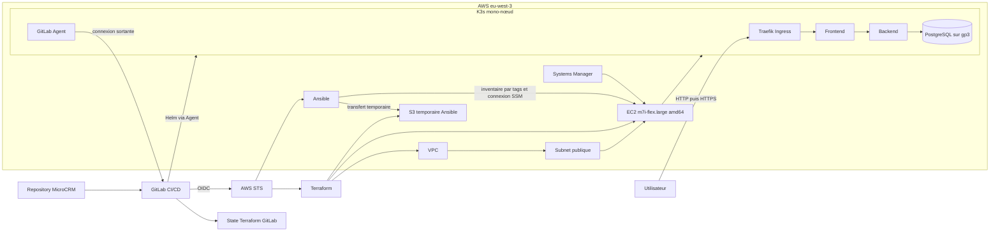

# Architecture AWS du POC

> Architecture du POC observée pendant la pipeline `main` `#2731910227` le
> 5 août 2026. Le cycle AWS a ensuite été détruit ; cette vue décrit les
> composants réellement utilisés, pas une infrastructure permanente.

## Limite et évolution

L'architecture réalisée pour le POC restera mono-nœud : l'EC2, son Availability
Zone et son volume constituent des points uniques de panne. Les redémarrages
Kubernetes, les backups et la reconstruction par IaC améliorent la résilience,
mais ne constituent pas une haute disponibilité.

Une cible de production ajouterait plusieurs nodes répartis entre plusieurs
Availability Zones, une entrée réseau redondée et une base de données répliquée.
Cette cible est une recommandation et ne sera pas présentée comme déployée.

## Preuve du cycle

La pipeline `#2731910227` a réussi le deployment Helm, la vérification des
workloads Kubernetes et `deploy:terraform:destroy`. Le schéma représente donc
le cycle exécuté, tandis que l'absence de ressources résiduelles doit rester
contrôlée dans AWS après chaque nouvelle session.
