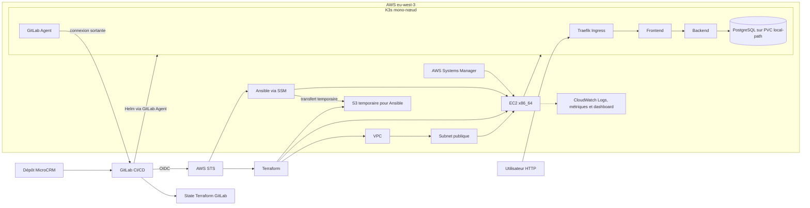

# Architecture AWS du POC

## Composants versionnés

| Couche | Configuration | Rôle |
|---|---|---|
| Réseau et EC2 | `infrastructure/terraform/` | VPC, subnet, routes, security group, IAM et instance K3s |
| Transfert Ansible | `infrastructure/terraform/modules/ansible_transfer/` | Bucket S3 temporaire et privé pour la connexion SSM |
| Configuration | `ansible/` | K3s, GitLab Agent et CloudWatch Agent conditionnel |
| Application | `helm/microcrm/` | Frontend, backend, PostgreSQL, Ingress et NetworkPolicies |
| Monitoring | Terraform et rôle Ansible `cloudwatch_agent` | Groupes de logs, métriques hôte et dashboard |

CloudWatch est créé uniquement lorsque `CLOUDWATCH_AGENT_ENABLED=true`. Le
dépôt ne crée aucune alarme CloudWatch.

## Limites

- Le POC utilise une seule instance EC2, une seule Availability Zone et un
  stockage PostgreSQL local au nœud.
- Le chart expose l’application par Traefik sans configuration TLS.
- L’infrastructure peut être reconstruite par IaC, mais cette reproductibilité
  ne remplace pas une sauvegarde des données.
- L’architecture versionnée a déjà été déployée lors des cycles de preuve. La
  reconstruction complète du monitoring après destruction reste à observer.
