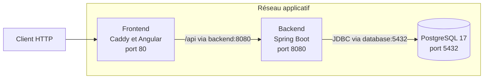

# Architecture des conteneurs MicroCRM

| Composant | Image | Santé | Données |
|---|---|---|---|
| Frontend | `misc/docker/frontend.Dockerfile` | HTTP `/` | Aucune |
| Backend | `misc/docker/backend.Dockerfile` | HTTP `/` | Schéma Liquibase dans PostgreSQL |
| PostgreSQL | Image officielle épinglée dans `.gitlab-ci.yml` | `pg_isready` | Volume persistant |

Le frontend est le seul point d’entrée. Caddy transmet `/api` au service
`backend`. Le backend joint `database:5432` par DNS. Les identifiants de base
sont injectés par variables d’environnement.

Le job `verify:images` construit un réseau Docker temporaire, vérifie les trois
healthchecks et les utilisateurs non-root, appelle l’API via le frontend, puis
recrée PostgreSQL et le backend avec le même volume. Ce test prouve la
persistance sur ce volume, pas une sauvegarde ni une restauration.
