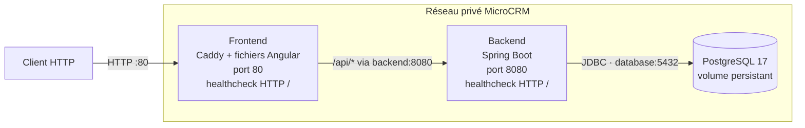

# Architecture des conteneurs MicroCRM

Ce schéma décrit l’architecture Docker retenue avant son déploiement avec
Kubernetes et Helm. Le frontend est le seul point d’entrée de l’application.

## Contrats entre les conteneurs

| Composant | Responsabilité | Entrée | Communication | Santé | Données |
|---|---|---|---|---|---|
| Frontend | Servir Angular et transmettre les requêtes `/api` | Port `80` | Résolution DNS du service `backend`, port `8080` | Requête HTTP sur `/` | Aucune donnée applicative |
| Backend | Exposer l’API REST MicroCRM | Port `8080`, non publié directement | Répond au frontend et joint `database:5432` | Requête HTTP sur `/` | PostgreSQL ; schéma versionné par Liquibase |
| PostgreSQL | Conserver les données métier | Port `5432`, non publié directement | Reçoit uniquement les connexions du backend | `pg_isready` | Volume Docker en test ; volume Kubernetes à définir en M |

## Règles retenues

- les images frontend et backend restent séparées ;
- les appels applicatifs utilisent la route relative `/api` ;
- le backend est joint par son nom de service, jamais par une adresse IP codée en dur ;
- seul le frontend est exposé à l’extérieur du réseau applicatif ;
- les images publiées sont identifiées par commit et par digest ;
- le `Dockerfile` historique multi-cibles a été retiré et reste conservé dans l’historique Git ;
- les identifiants de base sont injectés par variables d’environnement et ne sont pas versionnés ;
- le smoke test recrée PostgreSQL et le backend avec le même volume, puis vérifie que la donnée créée reste disponible ;
- le backup et le restore réels seront réalisés après définition du stockage Kubernetes/AWS.
