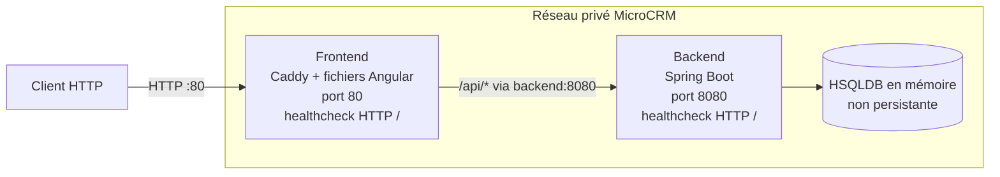

# Architecture des conteneurs MicroCRM

Ce schéma décrit l’architecture Docker retenue avant son déploiement avec
Kubernetes et Helm. Le frontend est le seul point d’entrée de l’application.

## Contrats entre les conteneurs

| Composant | Responsabilité | Entrée | Communication | Santé | Données |
|---|---|---|---|---|---|
| Frontend | Servir Angular et transmettre les requêtes `/api` | Port `80` | Résolution DNS du service `backend`, port `8080` | Requête HTTP sur `/` | Aucune donnée applicative |
| Backend | Exposer l’API REST MicroCRM | Port `8080`, non publié directement | Répond au frontend sur le réseau privé | Requête HTTP sur `/` | HSQLDB en mémoire dans l’état actuel |

## Règles retenues

- les images frontend et backend restent séparées ;
- les appels applicatifs utilisent la route relative `/api` ;
- le backend est joint par son nom de service, jamais par une adresse IP codée en dur ;
- seul le frontend est exposé à l’extérieur du réseau applicatif ;
- les images publiées sont identifiées par commit et par digest ;
- le `Dockerfile` historique multi-cibles a été retiré et reste conservé dans l’historique Git ;
- la persistance et le backup seront définis avant le déploiement Kubernetes.
