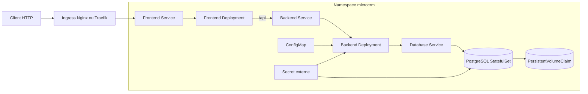

# Architecture Kubernetes cible

## Inventaire

| Objet | Responsabilité |
|---|---|
| Deployment frontend | Servir Angular et transmettre `/api` au backend |
| Deployment backend | Exposer l’API et exécuter les migrations Liquibase |
| StatefulSet PostgreSQL | Conserver l’identité et le volume de la base |
| Services | Fournir les noms DNS internes entre composants |
| Ingress | Exposer uniquement le frontend |
| ConfigMap | Externaliser la configuration non sensible du backend |
| Secret | Injecter les credentials sans les versionner |
| NetworkPolicies | Restreindre les flux entrants du backend au frontend et ceux de PostgreSQL au backend |
| PersistentVolumeClaim | Conserver les données PostgreSQL |

Minikube sert à valider localement le chart. La cible AWS prévue utilise K3s sur
une instance EC2 afin d’éviter le coût fixe du control plane EKS pour ce POC.
