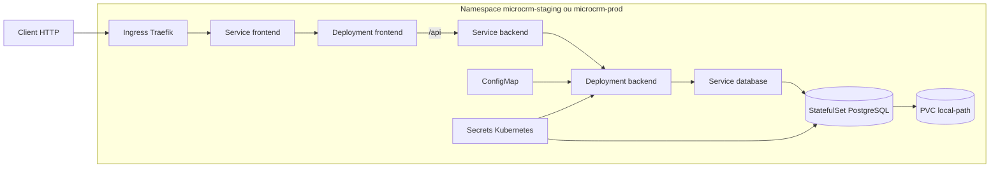

# Architecture Kubernetes

## Objets

| Objet | Fonction |
|---|---|
| Deployments frontend et backend | Exécuter les images applicatives non-root |
| StatefulSet PostgreSQL | Conserver l’identité du pod et monter le PVC |
| Services | Fournir les noms DNS `frontend`, `backend` et `database` |
| Ingress | Exposer uniquement le frontend |
| ConfigMap | Injecter la configuration backend non sensible |
| Secrets | Injecter les accès registry et PostgreSQL depuis les variables GitLab |
| NetworkPolicies | Autoriser frontend vers backend et backend vers PostgreSQL |
| PersistentVolumeClaim | Stocker les données PostgreSQL avec `local-path` sur K3s |

## Environnements

| Environnement | Namespace | Values | Déclenchement |
|---|---|---|---|
| Staging AWS | `microcrm-staging` | `values-staging.yaml` | Pipeline Web sur `dev` |
| Production du POC | `microcrm-prod` | `values-production.yaml` | Job manuel d’un tag SemVer |
| Validation locale | `microcrm` | `values-minikube.yaml` | Commandes locales, hors pipeline de déploiement AWS |

Le cluster AWS est K3s mono-nœud. Ansible installe K3s et le GitLab Agent. Les
jobs Helm utilisent ce dernier pour accéder au cluster sans exposer l’API
Kubernetes sur Internet.
