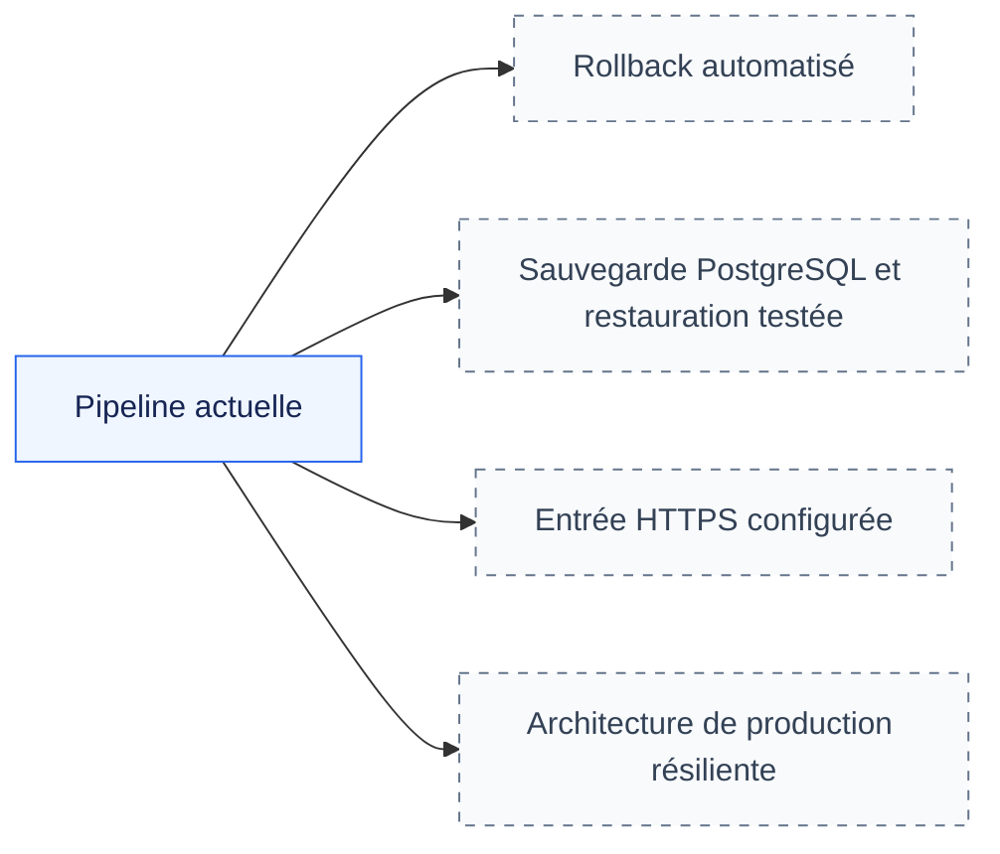

# Évolutions CI/CD non implémentées

L’architecture CI/CD versionnée est décrite dans le
[workflow actuel](workflow_ci_actuel.md). Ce fichier recense uniquement les
écarts encore ouverts.

| Évolution | État actuel | Condition de réalisation |
|---|---|---|
| Rollback automatisé | Aucun job dédié | Redéployer des digests connus et vérifier l’application |
| Sauvegarde des données | `backup.sh` valide seulement un `--dry-run` | Produire une sauvegarde PostgreSQL et réussir une restauration contrôlée |
| HTTPS | Ports réseau disponibles, aucun TLS configuré dans le chart | Configurer le certificat et l’Ingress |
| Production résiliente | POC K3s mono-nœud | Définir une architecture multi-nœuds et un stockage adapté |

Ces éléments sont des évolutions possibles. Ils ne décrivent pas des fonctions
disponibles dans le dépôt.
