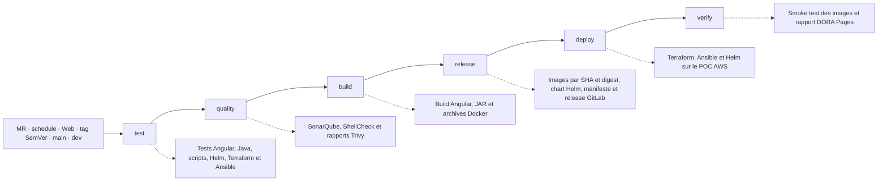

# Workflow CI/CD actuel

Source principale : `.gitlab-ci.yml` et `.gitlab/ci/*.yml`.

## Déclencheurs

| Événement | Pipeline créée | Effet spécifique |
|---|---:|---|
| Merge request | Oui | Contrôles, builds et scans ; aucune publication d’image |
| Push sur `dev` | Oui | Publication des images et du chart ; pas de déploiement AWS automatique |
| Push sur `main` | Oui | Publication des images et du chart ; pas de promotion production automatique |
| Tag SemVer `vX.Y.Z` | Oui | Manifeste, release GitLab et job production manuel |
| Pipeline Web sur `dev` ou `main` | Oui | Plan/apply Terraform et Ansible ; Helm staging seulement sur `dev` |
| Pipeline planifiée | Oui | Contrôles et scans sans publication d’image |
| Autre branche sans MR | Non | Bloquée par `workflow: rules` |

Les jobs d’un même stage peuvent s’exécuter en parallèle. Les relations `needs`
autorisent un job à démarrer dès que ses dépendances sont disponibles.

## Déploiements

- Staging : `deploy:helm:staging`, pipeline Web sur `dev`, environnement
  `aws-poc-staging`, namespace `microcrm-staging`.
- Production du POC : `deploy:helm:aws`, manuel sur un tag SemVer,
  environnement `aws-poc-production`, namespace `microcrm-prod`.
- Infrastructure : `deploy:terraform:apply` consomme le plan binaire produit par
  `quality:terraform:plan`. `deploy:terraform:destroy` exige
  `TF_DESTROY_CONFIRM=true` et un lancement manuel.
- Configuration : `deploy:ansible:check`, puis `deploy:ansible:apply` via AWS
  Systems Manager.

Le déploiement Helm utilise les digests produits par `release:images` et le
chart créé par `release:helm:package`. Le GitLab Agent fournit l’accès au
cluster K3s.

## Références

- Tests : [tests automatisés](../ci_cd/tests.md)
- Contrôles de sécurité : [sécurité CI/CD](../ci_cd/securite.md)
- Release et limites de reprise :
  [release, rollback et sauvegarde](../ci_cd/release_rollback_sauvegarde.md)
- Architecture déployée : [AWS](architecture_aws.md) et
  [Kubernetes](architecture_kubernetes.md)
