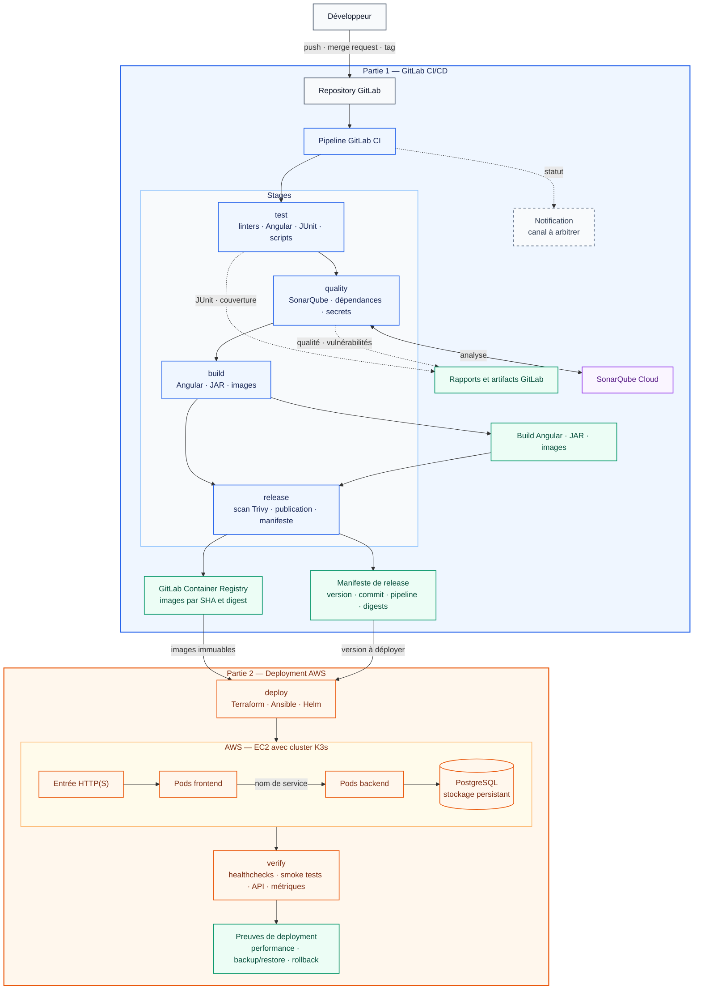

# Architecture CI/CD cible

**État :** architecture conçue en F.5 ; son implémentation sera prouvée progressivement dans les parties 1 et 2.

**Vue avant :** [workflow CI actuel](workflow_ci_actuel.md)

**Export :** [SVG](workflow_ci_cible.svg)

## Lecture du schéma

| Zone | Signification |
|---|---|
| Partie 1 — bleu | Pipeline GitLab à mettre en œuvre et prouver pendant la partie 1 |
| Sorties — vert | Rapports, artifacts, images et manifeste conservés comme preuves |
| Services — violet | Service externe utilisé par la CI |
| Partie 2 — orange | Infrastructure et deployment AWS à réaliser pendant la partie 2 |
| Pointillé gris | Élément prévu dont le choix final reste à arbitrer |

## Règles de circulation

- une merge request exécute `test → quality → build → scan des images`, sans publication ;
- avec SonarQube Cloud Free, le job `quality:sonarqube` analyse les merge requests et `main`, mais pas les push directs sur `dev` ;
- `release` publie uniquement depuis la branche principale ou un tag autorisé ;
- une pipeline planifiée répète les tests et scans sans publier d’image ;
- `deploy` consomme les images et le manifeste produits par la release ;
- le frontend rejoint le backend par un nom de service, sans adresse IP codée en dur ;
- `verify` intervient après le deployment et conserve ses résultats comme preuves.

## Traçabilité avant/après

| État | Référence |
|---|---|
| Avant | branche `dev`, commit `526bd96cddd2903676988b56dfeb2778667aa435` |
| Cible conçue | présent schéma F.5 |
| Après | release finale et commit à renseigner après l’implémentation |
